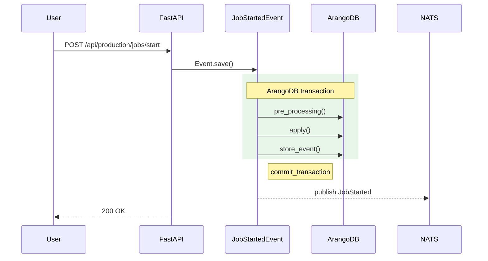

# Docs Workstream Conventions

**Status:** Initial scope (Phase 1 / D-14). Sections marked **STUB** are populated in Phase 2/3 as patterns crystallize.

## 1. Endpoint docstring shape (Pitfall 2.1)

Every public-facing endpoint in `backend/api/endpoints/` uses:

- One-line summary (FastAPI extracts as `summary` in OpenAPI).
- Multi-line markdown description below the summary.
- Trailing block:
  - **Emits:** comma-separated event types this endpoint creates.
  - **Required scope:** auth / role requirement.

Example:

```python
@router.post("/jobs/start", response_model=JobStartResponse, responses={409: {"model": ConflictResponse}})
async def start_job(payload: JobStartRequest):
    """Start a job from a planned work order.

    Promotes the job from `planned` to `running`, allocates a transaction-scoped
    `JobStartedEvent`, and notifies subscribers via the `production` NATS subject.

    **Emits:** `JobStartedEvent`
    **Required scope:** `production:job:start`
    """
```

## 2. AI drafting prompt scaffold (Pitfall 5.1, 5.3)

### Grounding rule (non-negotiable)

Every example value, field name, parameter name, and code snippet in AI-drafted
content MUST originate in `docs/public/openapi.json` or the corresponding
source file under `backend/api/`. No invented values. If the source is ambiguous,
leave a `<!-- TODO: verify -->` comment instead of guessing.

### Endpoint sweep prompt template

> You are documenting the FastAPI endpoint `{function_name}` in `backend/api/endpoints/{file}.py`.
> Read the source verbatim using the Read tool. Do NOT invent fields, parameters, or behaviors not present in the source.
>
> Your output:
>
> 1. Add a docstring matching CONVENTIONS.md §1 shape:
>    - One-line summary (becomes OpenAPI `summary`).
>    - Multi-line markdown description.
>    - Trailing **Emits:** block listing event class names this endpoint instantiates (read the function body to find them; write `*(direct transaction — no event class)*` if none).
>    - Trailing **Required scope:** block (read `dependencies=[Depends(auth.verify_token)]` — public routes write `*(public — no auth)*`).
> 2. Add `response_model=` to the `@router.<method>` decorator. Default: `response_model=APIResponse` (from `utils.api`). Endpoints that return typed lists or specific models use the actual return type — verify by reading the function body.
> 3. Add `responses={...}` covering documented non-200 paths the handler raises (404, 409, 500). Use shared response models if they exist in `models/`; otherwise inline `{"description": "..."}` entries.
> 4. For every Pydantic input/output model touched, add `Field(..., description=, examples=)` to every field. The `examples=` value MUST originate in source-code constants, fixture data, or be a clearly-illustrative literal (e.g., `"WO-2026-001"` for a work order code).
>
> Constraints (D-03):
> - Do NOT modify `except:` or `except Exception:` blocks. Document via `responses={500: ...}`, do not refactor.
> - Do NOT change function signatures, route paths, or `dependencies=` values.
> - Do NOT add new endpoints or remove existing ones.
>
> After draft, the human reviewer applies the curation gate (§4).

### Event page prompt template

> You are documenting `{EventClassName}` from `backend/api/events/{domain}/{file}.py`.
> Read the source verbatim using the Read tool. Extract:
>   - InfoModel fields and types (exact — no invented fields). Walk the nested `class InfoModel(EventInfoModel):` body.
>   - `apply()` mutations: which collections are written, what fields change. Read the apply() method body.
>   - `post_processing()` side effects: child events spawned via `create_as_child(...)`, NATS publish behavior. If the event has no `post_processing` override, note "Inherits post_processing() from `Base{Domain}Event`".
>   - `_notification_subtopic`: class attribute (or inherited from base). Map to NATS subject via the table in CONVENTIONS.md §3 / RESEARCH.md §NATS Subtopic Map. If `None`, write `—` for NATS subject.
>
> Your output: markdown matching `docs/.vitepress/templates/event.md` with all `{placeholder}` tokens replaced from extracted source data.
>
> Prose constraint (Pitfall 5.3 — anti-bland-prose): The 1–2 prose sentences below the metadata block must name specific preconditions and state changes. Do NOT use filler phrases like "this event handles", "allows users to", or "is responsible for".
>
> After draft, the human reviewer applies the curation gate (§4).

### Section template reference

Templates live at `docs/.vitepress/templates/`:
- [`endpoint.md`](../../docs/.vitepress/templates/endpoint.md) — for API reference pages (`<OAOperation>` + Events Emitted block).
- [`event.md`](../../docs/.vitepress/templates/event.md) — for Events reference pages (EVT-04 H2 structure + Mermaid placeholder).

Both templates are read-only references. Sweep agents copy the structure into target files; they do not modify the templates themselves.

## 3. Mermaid sequenceDiagram transaction-boundary convention (Pitfall 3.2)

For every event documented with a sequence diagram:

- Use `rect rgb(232, 245, 233)` to highlight the ArangoDB transaction boundary.
- The `rect` encloses `pre_processing` + `apply` + `store_event` calls.
- A `Note right of <EventName>: commit_transaction` follows the rect.
- Post-commit NATS publish arrows go AFTER the Note.

Example:



For diagrams with >20 nodes, opt into ELK via per-diagram frontmatter:

```
---
config:
  layout: elk
---
flowchart TD
  ...
```

(Pitfall 3.3 / RESEARCH.md §E.6.)

## 4. Curation gate (Pitfall 5.4)

Every page under `/users/`, `/admins/`, `/cli/` requires a non-author review pass before shipping. Pages that fail or are not yet curated ship as `> 🚧 Coming soon` placeholders, NOT as raw AI prose. The curation reviewer checks:

- All examples present in source / `openapi.json`.
- No hallucinated fields / parameters / events.
- Concrete language (not "this module lets you manage your X").
- Correct `Related:` cross-links.

## 5. Source-code permalink template (D-13 / SITE-08)

Permalinks ALWAYS template to GitHub, never GitLab:

```
https://github.com/ProgressLabIT/progress-platform/blob/<sha>/<path>
```

Use the build-time commit SHA, NOT `DEV`, so permalinks are stable across rebases. Phase 2's openapi-export script will record the SHA and inject it into the rendered API pages.

## 6. URL kebab-case convention (D-08)

Markdown filenames use kebab-case:

- ✓ `job-started.md` → `/events/production/job-started/`
- ✗ `job_started.md` (snake_case file) → `/events/production/job_started/` (URL non-canonical)

Matches D-08 URL contract.

## 7. Screenshot placeholders (D-02 / Phase 3)

L2 user-walkthrough pages (`docs/users/*.md`) ship in v1 without screenshots.
Every screen description reserves a placeholder slot using an HTML comment so
a post-launch human (or capture script) can swap to a real `` image link
without restructuring the page.

Format:

```markdown
<!-- screenshot: {module}-{screen-slug} -->
```

Rules:

- One placeholder per `### {Screen}` heading.
- One additional placeholder at the top of the page (just under the H1) for
  the module-overview shot.
- `{module}` matches the page slug (`production`, `inventory`, `counting`,
  `user-hub`, `warehouse`).
- `{screen-slug}` is kebab-case derived from the screen heading
  (e.g. `### Work-order detail` → `screenshot: production-work-order-detail`).
- A second example: `### Inventory dashboard` → `screenshot: inventory-dashboard`.
- HTML comments survive markdown→HTML rendering invisibly and are skipped by
  `lychee` — no CI warnings.
- Do NOT use `` tags, custom Vue components, or commented-out
  `` syntax. The plain HTML comment is the only allowed form.

Post-launch swap target:

```markdown

```

The swap is one-line and `grep`-able.

## 8. CLI page validation contract (D-07 / CLI-04)

Pages under `docs/cli/` are gated by `tests/cli/test_cli_help.py`, which
invokes `progress {command} --help` via `typer.testing.CliRunner` and
snapshot-compares the output to `tests/cli/snapshots/progress_{cmd}_help.txt`.
Drift fails CI.

### Frontmatter contract

Every `docs/cli/*.md` page declares whether its underlying `cli/{cmd}.py`
source has shipped:

```yaml
---
title: progress {command}
description: progress {command} reference — Progress Platform.
cli_validated: true     # default — snapshot test runs unconditionally
---
```

When the source has NOT yet shipped (sparkplug-demo S4 is still delivering
`cli/{init,restore,tap}.py` per ADR-0006), the page ships with:

```yaml
---
title: progress {command}
description: progress {command} reference — Progress Platform.
cli_validated: false    # snapshot test skips for this command
---

> 🚧 Coming soon — `progress {command}` is in active development; this
> page will be promoted to validated content when the underlying source
> lands.
```

The `cli_validated: false` flag is **temporary**; remove it (and the
"Coming soon" callout) on the same PR that lands `cli/{cmd}.py` registration.

### Snapshot lifecycle

- **First run after `cli_validated: true` is set:** the test writes
  `tests/cli/snapshots/progress_{cmd}_help.txt` and skips with a "Wrote
  initial snapshot — re-run" message.
- **Every subsequent run:** byte-for-byte equality with the snapshot.
- **Intentional refresh** (e.g. flag rename in `cli/{cmd}.py`): delete the
  snapshot file in the same PR that updates `docs/cli/{cmd}.md`. CI
  regenerates and the next run passes.

Do NOT manually edit snapshot files.
