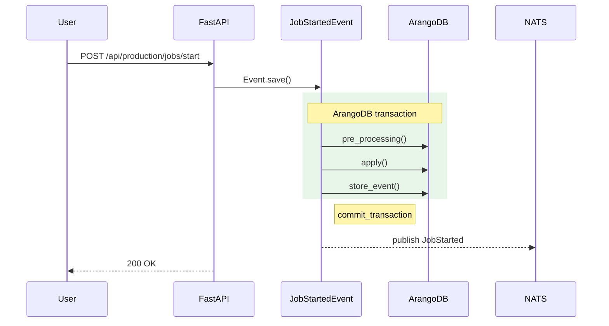

# Docs Workstream Conventions

**Status:** Initial scope (Phase 1 / D-14). Sections marked **STUB** are populated in Phase 2/3 as patterns crystallize.

## 1. Endpoint docstring shape (Pitfall 2.1)

Every public-facing endpoint in `backend/api/endpoints/` uses:

- One-line summary (FastAPI extracts as `summary` in OpenAPI).
- Multi-line markdown description below the summary.
- Trailing block:
  - **Emits:** comma-separated event types this endpoint creates.
  - **Required scope:** auth / role requirement.

Example:

```python
@router.post("/jobs/start", response_model=JobStartResponse, responses={409: {"model": ConflictResponse}})
async def start_job(payload: JobStartRequest):
    """Start a job from a planned work order.

    Promotes the job from `planned` to `running`, allocates a transaction-scoped
    `JobStartedEvent`, and notifies subscribers via the `production` NATS subject.

    **Emits:** `JobStartedEvent`
    **Required scope:** `production:job:start`
    """
```

## 2. AI drafting prompt scaffold (Pitfall 5.1, 5.3) — STUB

Phase 2/3 will refine this scaffold per-section. Initial template:

> "You are documenting `{symbol}` from `{source_path}`. Read the source verbatim. Do NOT invent fields, parameters, or behaviors not present. Output markdown matching the section template at `.planning/workstreams/docs/templates/{section}.md`. After draft, the human reviewer applies the curation gate (§4)."

The grounding rule (Pitfall 5.1) is non-negotiable: every example value must originate in `openapi.json` or source code. The anti-bland-prose rule (Pitfall 5.3) is enforced by the curation gate.

## 3. Mermaid sequenceDiagram transaction-boundary convention (Pitfall 3.2)

For every event documented with a sequence diagram:

- Use `rect rgb(232, 245, 233)` to highlight the ArangoDB transaction boundary.
- The `rect` encloses `pre_processing` + `apply` + `store_event` calls.
- A `Note right of <EventName>: commit_transaction` follows the rect.
- Post-commit NATS publish arrows go AFTER the Note.

Example:



For diagrams with >20 nodes, opt into ELK via per-diagram frontmatter:

```
---
config:
  layout: elk
---
flowchart TD
  ...
```

(Pitfall 3.3 / RESEARCH.md §E.6.)

## 4. Curation gate (Pitfall 5.4)

Every page under `/users/`, `/admins/`, `/cli/` requires a non-author review pass before shipping. Pages that fail or are not yet curated ship as `> 🚧 Coming soon` placeholders, NOT as raw AI prose. The curation reviewer checks:

- All examples present in source / `openapi.json`.
- No hallucinated fields / parameters / events.
- Concrete language (not "this module lets you manage your X").
- Correct `Related:` cross-links.

## 5. Source-code permalink template (D-13 / SITE-08)

Permalinks ALWAYS template to GitHub, never GitLab:

```
https://github.com/ProgressLabIT/progress-platform/blob/<sha>/<path>
```

Use the build-time commit SHA, NOT `DEV`, so permalinks are stable across rebases. Phase 2's openapi-export script will record the SHA and inject it into the rendered API pages.

## 6. URL kebab-case convention (D-08)

Markdown filenames use kebab-case:

- ✓ `job-started.md` → `/events/production/job-started/`
- ✗ `job_started.md` (snake_case file) → `/events/production/job_started/` (URL non-canonical)

Matches D-08 URL contract.
