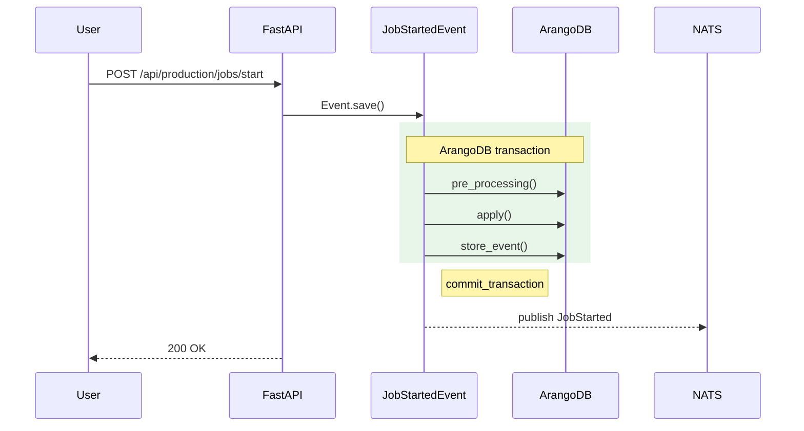

<goal>
A VitePress 1.6.4 site at `docs/` builds locally without errors, the URL contract is locked across 10 stub pages plus a homepage, the hand-written sidebar is the only navigation source, MiniSearch + sitemap + Mermaid + vitepress-openapi are wired against the locked decisions, and `.planning/workstreams/docs/CONVENTIONS.md` is authored — all delivered by a single autonomous agent in one session.
</goal>

<scope>
Files created (24):

- `docs/package.json` (new — exact pins per RESEARCH.md §Standard Stack)
- `docs/package-lock.json` (generated by `npm install` — committed per CP-1)
- `docs/.gitignore` (new — node_modules, .vitepress/cache, .vitepress/dist)
- `docs/.vitepress/config.ts` (new — RESEARCH.md §E.2 verbatim, with CP-3 / CP-4 corrections)
- `docs/.vitepress/theme/index.ts` (new — RESEARCH.md §E.3 verbatim, CP-5 SSR guard)
- `docs/.vitepress/theme/custom.css` (new — single brand-color CSS variable)
- `docs/public/openapi.json` (new — RESEARCH.md §E.4 placeholder)
- `docs/public/robots.txt` (new — RESEARCH.md §E.5)
- `docs/index.md` (new — homepage)
- 10 contract pages (5 landings + 5 stubs per D-07 / RESEARCH.md §G)
- `.planning/workstreams/docs/CONVENTIONS.md` (new — D-14 initial scope, RESEARCH.md §H)

Files deleted (2 — D-05):

- `docs/superpowers/plans/2026-04-15-custom-data.md`
- `docs/superpowers/specs/2026-04-15-custom-data-design.md`

Files NOT touched in this plan:

- Repo-root OSS files (owned by 01-01)
- `.github/workflows/**` (owned by 01-03)
- Backend / webapps / cli sources

Locally executed (no commit):

- `npm install` inside `docs/` (generates `package-lock.json`)
- `npm run docs:build` smoke test (Assumption A6 / A9 verification)
</scope>

<requirements>
| Req ID | Verification anchor |
|--------|---------------------|
| SITE-01 | Anchor 4 — `docs/package.json` + `docs/.vitepress/config.ts` exist; `npm run docs:build` succeeds locally |
| SITE-02 | Anchor 5 — `vitepress-plugin-mermaid` 2.0.17 in deps; `@mermaid-js/layout-elk` registered behind SSR guard in `theme/index.ts` |
| SITE-03 | Anchor 5 — `themeConfig.sidebar` is hand-written; no auto-sidebar plugin in `package.json` |
| SITE-04 | Anchor 3 — `themeConfig.nav` declares `[API, Events, CLI, Users, Admins]` in D-07 order |
| SITE-05 | Anchor 4 — `themeConfig.search.provider = 'local'` in `config.ts` |
| SITE-06 | Anchor 4 — `sitemap.hostname` configured to `https://progresslabit.github.io/progress-platform/` |
| SITE-08 | Anchor 5 — `editLink.pattern` and CONVENTIONS.md source-code permalink template both target `github.com/ProgressLabIT/progress-platform/...` |
| SITE-10 | Anchor 3 — 10 contract pages exist with locked frontmatter; relative cross-link patterns exercised |
| SITE-12 | Anchor 5 — `vitepress-openapi` wired against `docs/public/openapi.json` placeholder slot; build artefact slot exists |
</requirements>

<approach>

## Execution Order

Single autonomous agent session. Sequential within the plan; the only smoke test is `npm run docs:build` after Tasks 1-7.

1. Delete `docs/superpowers/` (D-05) — clear the namespace.
2. Initialize npm package (`docs/package.json`, `docs/.gitignore`).
3. Install pinned dependencies — generate `docs/package-lock.json`.
4. Write `docs/.vitepress/config.ts` (site config, nav, sidebar, sitemap, search, editLink, mermaid).
5. Write `docs/.vitepress/theme/index.ts` (theme extension, ELK loader, vitepress-openapi).
6. Write `docs/.vitepress/theme/custom.css`, `docs/public/openapi.json`, `docs/public/robots.txt`.
7. Write the 11 markdown pages (homepage + 5 landings + 5 stubs).
8. Smoke test: `npm run docs:build` from `docs/`. Assert exit 0 and `dist/index.html` exists.
9. Author `.planning/workstreams/docs/CONVENTIONS.md` (D-14 initial scope).

## Task 1 — Delete `docs/superpowers/` (D-05)

```bash
git rm -r docs/superpowers/
# Confirms: docs/ now contains only what this plan creates
```

Verify clean root: `find docs -maxdepth 1 -type f` should be empty post-delete and pre-Task-2.

## Task 2 — Initialize `docs/package.json` and `docs/.gitignore`

Write `docs/package.json` (exact content; all version pins from RESEARCH.md §Standard Stack):

```json
{
  "name": "@progresslab/progress-platform-docs",
  "version": "0.0.1",
  "private": true,
  "license": "Apache-2.0",
  "engines": {
    "node": "20.19.0"
  },
  "scripts": {
    "docs:dev": "vitepress dev .",
    "docs:build": "vitepress build .",
    "docs:preview": "vitepress preview ."
  },
  "devDependencies": {
    "vitepress": "1.6.4",
    "vitepress-plugin-mermaid": "2.0.17",
    "vitepress-openapi": "0.1.20",
    "mermaid": "^11.14.0",
    "@mermaid-js/layout-elk": "^0.2.1"
  }
}
```

Write `docs/.gitignore`:

```
node_modules/
.vitepress/cache/
.vitepress/dist/
```

CP-1 enforcement: `vitepress`, `vitepress-plugin-mermaid`, `vitepress-openapi` use exact pins (no `^`). `mermaid` and `@mermaid-js/layout-elk` use `^` since they are transitive of the plugin's API surface and minor patches are safe.

## Task 3 — Install deps (generates `package-lock.json`)

```bash
cd docs && npm install
```

Verify Node version matches `engines`:

```bash
node --version   # expected: v20.19.0
```

If `npm install` warns about peer-dep conflicts (Assumption A6 risk): fall back to `vitepress-plugin-mermaid@2.0.16`. If that also fails: SURFACE AS DEVIATION — do not silently downgrade VitePress.

`docs/package-lock.json` is committed (CP-1: locked dependency tree is the only protection against `npm install` drift mid-launch).

## Task 4 — Write `docs/.vitepress/config.ts`

Lift verbatim from RESEARCH.md §E.2, with these specific gates:

- `base: '/progress-platform/'` — D-13 (CP-3: must match sitemap hostname path).
- `sitemap.hostname: 'https://progresslabit.github.io/progress-platform/'` — D-13 (CP-3: includes `base` path).
- `cleanUrls: true` — required for the URL contract.
- All sidebar links omit `.html` suffix (CP-4).
- `themeConfig.search.provider: 'local'` — D-locked, MiniSearch (Pitfall 1.3).
- `themeConfig.nav` order: `API, Events, CLI, Users, Admins` — D-07.
- `themeConfig.sidebar` hand-written (no auto-sidebar plugin imported anywhere — Pitfall 1.2).
- `editLink.pattern: 'https://github.com/ProgressLabIT/progress-platform/edit/DEV/docs/:path'` — D-13 (SITE-08; never gitlab.com).
- `lastUpdated: true` (works because `actions/checkout@v5` is configured with `fetch-depth: 0` in plan 01-03; CP-9).
- `ignoreDeadLinks: false` (Pitfall 1.4: do not silence; let lychee catch fragments separately).
- `socialLinks` includes both github (canonical brand) and gitlab (canonical source) — visitors can find the source repo.

Full content (use this exact text):

````typescript
// docs/.vitepress/config.ts
import { defineConfig } from 'vitepress'
import { withMermaid } from 'vitepress-plugin-mermaid'

export default withMermaid(defineConfig({
  // Site identity
  lang: 'en-US',
  title: 'Progress Platform',
  description: 'Manufacturing Operations Management — event-sourced MES on FastAPI + ArangoDB + Vue 3.',
  base: '/progress-platform/',  // D-13: GH Pages project base
  cleanUrls: true,              // CP-4: sidebar links omit .html
  lastUpdated: true,            // CP-9: requires fetch-depth: 0 in deploy workflow
  ignoreDeadLinks: false,       // Pitfall 1.4: lychee handles fragments separately

  // SEO / discoverability
  sitemap: {
    hostname: 'https://progresslabit.github.io/progress-platform/',  // D-13 / CP-3
  },

  head: [
    ['link', { rel: 'icon', href: '/progress-platform/favicon.ico' }],
    ['meta', { name: 'theme-color', content: '#0066cc' }],
  ],

  markdown: {
    lineNumbers: true,
  },

  themeConfig: {
    siteTitle: 'Progress Platform',

    // D-07: 5 sections in fixed order
    nav: [
      { text: 'API', link: '/api/' },
      { text: 'Events', link: '/events/' },
      { text: 'CLI', link: '/cli/' },
      { text: 'Users', link: '/users/' },
      { text: 'Admins', link: '/admins/' },
    ],

    // Pitfall 1.2: hand-written sidebar (no auto-sidebar plugin)
    // CP-4: links omit .html (cleanUrls: true)
    sidebar: {
      '/api/': [
        { text: 'API Reference', items: [
          { text: 'Overview', link: '/api/' },
          { text: 'production: jobs/start', link: '/api/production/jobs/start' },
        ]},
      ],
      '/events/': [
        { text: 'Events Reference', items: [
          { text: 'Overview', link: '/events/' },
          { text: 'production: JobStarted', link: '/events/production/job-started' },
        ]},
      ],
      '/cli/': [
        { text: 'CLI Reference', items: [
          { text: 'Overview', link: '/cli/' },
          { text: 'progress init', link: '/cli/init' },
        ]},
      ],
      '/users/': [
        { text: 'User Documentation', items: [
          { text: 'Overview', link: '/users/' },
          { text: 'Production', link: '/users/production' },
        ]},
      ],
      '/admins/': [
        { text: 'Admin & Integrator', items: [
          { text: 'Overview', link: '/admins/' },
          { text: 'Deployment', link: '/admins/deployment' },
        ]},
      ],
    },

    // Pitfall 1.3 / SITE-05: MiniSearch local search
    search: {
      provider: 'local',
      options: {
        detailedView: true,
        miniSearch: {
          searchOptions: {
            fuzzy: 0.2,
            prefix: true,
            boost: { title: 4, text: 2, titles: 1 },
          },
        },
      },
    },

    socialLinks: [
      { icon: 'github', link: 'https://github.com/ProgressLabIT/progress-platform' },
      { icon: 'gitlab', link: 'https://gitlab.com/progresslab/progress-platform' },
    ],
    footer: {
      message: 'Released under the Apache 2.0 License.',
      copyright: 'Copyright © 2026 Progress Platform Contributors.',
    },

    // D-13 / SITE-08: source-code permalinks always github.com (never gitlab)
    editLink: {
      pattern: 'https://github.com/ProgressLabIT/progress-platform/edit/DEV/docs/:path',
      text: 'Edit this page on GitHub',
    },
  },

  mermaid: {
    theme: 'default',
  },
  mermaidPlugin: {
    class: 'mermaid my-mermaid',
  },
}))
````

DO NOT run `npm exec vitepress init` (CP-2 — wizard pollutes `docs/` root with placeholder pages that collide with the URL contract).

## Task 5 — Write `docs/.vitepress/theme/index.ts` (vitepress-openapi + ELK loader)

Lift from RESEARCH.md §E.3. CP-5 enforcement: ELK loader registration MUST be inside the `typeof window !== 'undefined'` guard, otherwise `vitepress build`'s SSR pass throws `ReferenceError: window is not defined`.

````typescript
// docs/.vitepress/theme/index.ts
import DefaultTheme from 'vitepress/theme'
import type { Theme } from 'vitepress'
import { theme as openapiTheme, useOpenapi } from 'vitepress-openapi/client'
import 'vitepress-openapi/dist/style.css'
import './custom.css'

import mermaid from 'mermaid'
import elkLayouts from '@mermaid-js/layout-elk'

// Phase 1: load placeholder spec; Phase 2 swaps in the real export
import spec from '../public/openapi.json' with { type: 'json' }

// CP-5: SSR guard — ELK loader registration must be browser-only
if (typeof window !== 'undefined') {
  mermaid.registerLayoutLoaders(elkLayouts)
}

export default {
  extends: DefaultTheme,
  async enhanceApp({ app }) {
    useOpenapi({ spec })
    openapiTheme.enhanceApp({ app })
  },
} satisfies Theme
````

## Task 6 — Write `custom.css`, `openapi.json`, `robots.txt`

`docs/.vitepress/theme/custom.css`:

```css
:root {
  --vp-c-brand-1: #0066cc;
  --vp-c-brand-2: #0080ff;
  --vp-c-brand-3: #3399ff;
}
```

`docs/public/openapi.json` (Assumption A9 — empty-paths is valid OpenAPI 3.x; smoke test in Task 8 confirms `vitepress-openapi` does not throw):

```json
{
  "openapi": "3.0.4",
  "info": {
    "title": "Progress Platform API",
    "version": "0.0.0-placeholder",
    "description": "Placeholder — populated in Phase 2 from `scripts/export_openapi.py`."
  },
  "paths": {}
}
```

`docs/public/robots.txt`:

```
User-agent: *
Allow: /

Sitemap: https://progresslabit.github.io/progress-platform/sitemap.xml
```

## Task 7 — Write the 11 markdown pages (homepage + 10 contract pages)

The full URL contract per RESEARCH.md §G is locked. Create exactly these files (no more, no less in Phase 1):

| File path | URL (with base) | Type |
|-----------|-----------------|------|
| `docs/index.md` | `/progress-platform/` | Homepage |
| `docs/api/index.md` | `/progress-platform/api/` | Section landing |
| `docs/api/production/jobs/start.md` | `/progress-platform/api/production/jobs/start/` | Stub |
| `docs/events/index.md` | `/progress-platform/events/` | Section landing |
| `docs/events/production/job-started.md` | `/progress-platform/events/production/job-started/` | Stub |
| `docs/cli/index.md` | `/progress-platform/cli/` | Section landing |
| `docs/cli/init.md` | `/progress-platform/cli/init/` | Stub |
| `docs/users/index.md` | `/progress-platform/users/` | Section landing |
| `docs/users/production.md` | `/progress-platform/users/production/` | Stub |
| `docs/admins/index.md` | `/progress-platform/admins/` | Section landing |
| `docs/admins/deployment.md` | `/progress-platform/admins/deployment/` | Stub |

**Homepage** `docs/index.md`:

```markdown
---
title: Progress Platform Documentation
description: Manufacturing Operations Management — event-sourced MES on FastAPI + ArangoDB + Vue 3.
---

# Progress Platform Documentation

Public documentation for the Progress Platform open-source release. Site scaffold; content lands in Phase 2/3.

- [API Reference](/api/)
- [Events Reference](/events/)
- [CLI Reference](/cli/)
- [User Documentation](/users/)
- [Admin & Integrator](/admins/)
```

**Section landings (5)** — apply the same template to each, substituting `<Section>` and `<phase>`:

```markdown
---
title: <Section name>
description: <Section> reference — Progress Platform.
---

# <Section name>

> 🚧 Coming soon — populated in Phase <2 or 3>.

This page is a Phase 1 scaffold; the URL is locked. Content lands when Phase <2 or 3> of the docs workstream completes.

Related: [Events](/events/) · [API](/api/) · [Home](/)
```

Section/phase mapping:

| File | `<Section name>` | `<phase>` |
|------|------------------|-----------|
| `docs/api/index.md` | API Reference | 2 |
| `docs/events/index.md` | Events Reference | 2 |
| `docs/cli/index.md` | CLI Reference | 3 |
| `docs/users/index.md` | User Documentation | 3 |
| `docs/admins/index.md` | Admin & Integrator | 3 |

**Stubs (5)** — same template, deeper page identity:

| File | `<Section name>` | `<phase>` |
|------|------------------|-----------|
| `docs/api/production/jobs/start.md` | POST /api/production/jobs/start | 2 |
| `docs/events/production/job-started.md` | JobStartedEvent | 2 |
| `docs/cli/init.md` | progress init | 3 |
| `docs/users/production.md` | Production Module | 3 |
| `docs/admins/deployment.md` | Deployment | 3 |

The `Related:` line on every stub deliberately exercises three real cross-link patterns (sibling-section landing + own-section landing + homepage). The lychee gate in plan 01-03 will catch any sidebar-key mistypes immediately because every stub re-resolves these links.

## Task 8 — Smoke test: `npm run docs:build`

```bash
cd docs && npm run docs:build
```

Resolves Assumption A6 (plugin compatibility) and Assumption A9 (empty-paths OpenAPI parses).

Expected outcome:

- Exit code 0.
- `docs/.vitepress/dist/` contains:
  - `index.html`
  - `api/index.html`, `api/production/jobs/start/index.html`
  - `events/index.html`, `events/production/job-started/index.html`
  - `cli/index.html`, `cli/init/index.html`
  - `users/index.html`, `users/production/index.html`
  - `admins/index.html`, `admins/deployment/index.html`
  - `sitemap.xml` containing entries with hostname `https://progresslabit.github.io/progress-platform/`
  - `assets/` directory with hashed JS/CSS

Failure modes and recovery:

- `ReferenceError: window is not defined` → CP-5 violated; verify `typeof window !== 'undefined'` guard in `theme/index.ts`.
- `Failed to import openapi.json` → CP-9 unrelated; verify `assert { type: 'json' }` syntax (TypeScript / Node 20.19 supports `with { type: 'json' }`).
- 404 in sitemap-emitted URLs (e.g., `/api/`) → CP-3 violated; sitemap hostname must include `/progress-platform/` path.
- Sidebar 404 to `*.html` paths → CP-4 violated; remove `.html` suffix from sidebar links.
- Peer-dep conflict on install → Assumption A6 risk: fall back to `vitepress-plugin-mermaid@2.0.16`; if that also fails, surface as deviation.

## Task 9 — Author `.planning/workstreams/docs/CONVENTIONS.md` (D-14)

D-14 initial scope per RESEARCH.md §H. Write to `.planning/workstreams/docs/CONVENTIONS.md`:

````markdown
# Docs Workstream Conventions

**Status:** Initial scope (Phase 1 / D-14). Sections marked **STUB** are populated in Phase 2/3 as patterns crystallize.

## 1. Endpoint docstring shape (Pitfall 2.1)

Every public-facing endpoint in `backend/api/endpoints/` uses:

- One-line summary (FastAPI extracts as `summary` in OpenAPI).
- Multi-line markdown description below the summary.
- Trailing block:
  - **Emits:** comma-separated event types this endpoint creates.
  - **Required scope:** auth / role requirement.

Example:

```python
@router.post("/jobs/start", response_model=JobStartResponse, responses={409: {"model": ConflictResponse}})
async def start_job(payload: JobStartRequest):
    """Start a job from a planned work order.

    Promotes the job from `planned` to `running`, allocates a transaction-scoped
    `JobStartedEvent`, and notifies subscribers via the `production` NATS subject.

    **Emits:** `JobStartedEvent`
    **Required scope:** `production:job:start`
    """
```
## 2. AI drafting prompt scaffold (Pitfall 5.1, 5.3) — STUB

Phase 2/3 will refine this scaffold per-section. Initial template:

> "You are documenting `{symbol}` from `{source_path}`. Read the source verbatim. Do NOT invent fields, parameters, or behaviors not present. Output markdown matching the section template at `.planning/workstreams/docs/templates/{section}.md`. After draft, the human reviewer applies the curation gate (§4)."

The grounding rule (Pitfall 5.1) is non-negotiable: every example value must originate in `openapi.json` or source code. The anti-bland-prose rule (Pitfall 5.3) is enforced by the curation gate.

## 3. Mermaid sequenceDiagram transaction-boundary convention (Pitfall 3.2)

For every event documented with a sequence diagram:

- Use `rect rgb(232, 245, 233)` to highlight the ArangoDB transaction boundary.
- The `rect` encloses `pre_processing` + `apply` + `store_event` calls.
- A `Note right of <EventName>: commit_transaction` follows the rect.
- Post-commit NATS publish arrows go AFTER the Note.

Example:



For diagrams with >20 nodes, opt into ELK via per-diagram frontmatter:

```
---
config:
  layout: elk
---
flowchart TD
  ...
```

(Pitfall 3.3 / RESEARCH.md §E.6.)

## 4. Curation gate (Pitfall 5.4)

Every page under `/users/`, `/admins/`, `/cli/` requires a non-author review pass before shipping. Pages that fail or are not yet curated ship as `> 🚧 Coming soon` placeholders, NOT as raw AI prose. The curation reviewer checks:

- All examples present in source / `openapi.json`.
- No hallucinated fields / parameters / events.
- Concrete language (not "this module lets you manage your X").
- Correct `Related:` cross-links.

## 5. Source-code permalink template (D-13 / SITE-08)

Permalinks ALWAYS template to GitHub, never GitLab:

```
https://github.com/ProgressLabIT/progress-platform/blob/<sha>/<path>
```

Use the build-time commit SHA, NOT `DEV`, so permalinks are stable across rebases. Phase 2's openapi-export script will record the SHA and inject it into the rendered API pages.

## 6. URL kebab-case convention (D-08)

Markdown filenames use kebab-case:

- ✓ `job-started.md` → `/events/production/job-started/`
- ✗ `job_started.md` (snake_case file) → `/events/production/job_started/` (URL non-canonical)

Matches D-08 URL contract.
````
</approach>

<threat_model>

ASVS L1; block on `high`. The site is build-time only (no server runtime), so threats are supply-chain (npm) and SSR-time JavaScript injection.

## Trust Boundaries

| Boundary | Description |
|----------|-------------|
| npm registry → developer machine / CI | dependency install pulls 5 direct + ~200 transitive packages; package-lock.json is the integrity gate |
| `docs/public/openapi.json` → built `dist/` | placeholder file; in Phase 2 this is populated from backend introspection — at that point the boundary becomes backend → docs |
| Markdown content → built HTML | VitePress sanitizes by default; content is authored by maintainers/AI, not user-submitted |

## STRIDE Threat Register

| Threat ID | Category | Component | Disposition | Mitigation Plan |
|-----------|----------|-----------|-------------|-----------------|
| T-01-02-01 | Tampering | Supply-chain attack via unpinned dep (typosquat or compromised maintainer) | mitigate | All three risky packages pinned EXACT (no `^`): `vitepress 1.6.4`, `vitepress-plugin-mermaid 2.0.17`, `vitepress-openapi 0.1.20`. `mermaid` and `@mermaid-js/layout-elk` allow `^` minor patches (lower-risk transitive surface). `package-lock.json` committed (CP-1). Dependabot config in plan 01-03 surfaces upstream advisories without auto-merging. |
| T-01-02-02 | Tampering | Mermaid 11 SSR pass crashes build silently | mitigate | CP-5 enforced: ELK loader registration is inside `typeof window !== 'undefined'` guard. Smoke test (Task 8) catches regressions. |
| T-01-02-03 | Information Disclosure | Placeholder `openapi.json` accidentally embeds backend internals | accept | Phase 1 placeholder explicitly has `paths: {}`; the file is hand-authored, no backend introspection runs in this plan. Phase 2 plan owns the backend-introspection security review. |
| T-01-02-04 | Spoofing | `editLink.pattern` accidentally points at gitlab.com (visitor lands on the canonical-but-not-public-mirror URL) | mitigate | D-13 / SITE-08 pattern hardcoded to `github.com/ProgressLabIT/progress-platform`. Verification grep enforced. |
| T-01-02-05 | Information Disclosure | `npm install` script execution from a transitive dep | accept | Standard Node.js / VitePress supply chain; no Phase 1 mitigation beyond pinning. Post-launch hardening: enable npm `--ignore-scripts` in CI (plan 01-03 already runs `npm ci`, which respects ignore-scripts if set). |
| T-01-02-06 | Tampering | Sidebar links accidentally use `.html` suffixes (CP-4) → 404s in production despite local-build success in some configs | mitigate | Sidebar links audited via grep in `<verification>`: `grep '\.html' docs/.vitepress/config.ts` must be empty (or matched only on comments). |

No `high`-severity threats remain after mitigation. Plan exits ASVS L1 block-on-high gate.

</threat_model>

<verification>

Run from repo root after Task 9.

```bash
# === Anchor 4: VitePress site initialized; build succeeds ===

# package.json with exact pins
test -f docs/package.json
jq -e '.devDependencies.vitepress == "1.6.4"' docs/package.json
jq -e '.devDependencies["vitepress-plugin-mermaid"] == "2.0.17"' docs/package.json
jq -e '.devDependencies["vitepress-openapi"] == "0.1.20"' docs/package.json
jq -e '.engines.node == "20.19.0"' docs/package.json
jq -e '.license == "Apache-2.0"' docs/package.json

# Lockfile committed (CP-1)
test -f docs/package-lock.json

# .gitignore excludes build artifacts
grep -q '^node_modules/' docs/.gitignore
grep -q '\.vitepress/dist/' docs/.gitignore
grep -q '\.vitepress/cache/' docs/.gitignore

# Build succeeds
(cd docs && npm run docs:build)
test -d docs/.vitepress/dist

# All 11 contract HTML files emitted
test -f docs/.vitepress/dist/index.html
test -f docs/.vitepress/dist/api/index.html
test -f docs/.vitepress/dist/api/production/jobs/start/index.html
test -f docs/.vitepress/dist/events/index.html
test -f docs/.vitepress/dist/events/production/job-started/index.html
test -f docs/.vitepress/dist/cli/index.html
test -f docs/.vitepress/dist/cli/init/index.html
test -f docs/.vitepress/dist/users/index.html
test -f docs/.vitepress/dist/users/production/index.html
test -f docs/.vitepress/dist/admins/index.html
test -f docs/.vitepress/dist/admins/deployment/index.html

# Sitemap emitted with correct hostname (CP-3)
test -f docs/.vitepress/dist/sitemap.xml
grep -F 'https://progresslabit.github.io/progress-platform/' docs/.vitepress/dist/sitemap.xml

# robots.txt
grep -F 'Sitemap: https://progresslabit.github.io/progress-platform/sitemap.xml' docs/.vitepress/dist/robots.txt

# === Anchor 4: MiniSearch local search enabled ===
grep -E "provider:\s*'local'" docs/.vitepress/config.ts

# === Anchor 4: Sitemap hostname matches base ===
grep -E "hostname:\s*'https://progresslabit\.github\.io/progress-platform/'" docs/.vitepress/config.ts

# === Anchor 3: 5 nav entries in D-07 order ===
grep -A 7 'nav:' docs/.vitepress/config.ts | \
  grep -E "text:\s*'(API|Events|CLI|Users|Admins)'" | wc -l   # expected: 5

# === Anchor 3: 10 contract pages exist ===
test "$(find docs/api docs/events docs/cli docs/users docs/admins -name '*.md' | wc -l)" -eq 10

# === Anchor 5: hand-written sidebar (no auto-sidebar plugin) ===
! jq -r '.devDependencies | keys[]' docs/package.json | grep -iE 'auto.sidebar|vitepress-sidebar'

# === Anchor 5: source-code permalinks → github.com (D-13 / SITE-08) ===
grep -F 'github.com/ProgressLabIT/progress-platform/edit/DEV/docs/' docs/.vitepress/config.ts
! grep -F 'gitlab.com' docs/.vitepress/config.ts

# === Anchor 5: vitepress-openapi wired against placeholder ===
grep -F "vitepress-openapi/client" docs/.vitepress/theme/index.ts
test -f docs/public/openapi.json
jq -e '.openapi | startswith("3.")' docs/public/openapi.json
jq -e '.paths == {}' docs/public/openapi.json

# === Anchor 5: ELK loader registered behind SSR guard (CP-5) ===
grep -F "typeof window !== 'undefined'" docs/.vitepress/theme/index.ts
grep -F 'mermaid.registerLayoutLoaders(elkLayouts)' docs/.vitepress/theme/index.ts

# === Anchor 5: Mermaid plugin enabled (SITE-02) ===
grep -F 'withMermaid' docs/.vitepress/config.ts
jq -e '.devDependencies["vitepress-plugin-mermaid"]' docs/package.json

# === SITE-10: URL contract locked — sidebar links omit .html suffix (CP-4) ===
# Match sidebar `link:` lines and assert none end in .html
! grep -E "link:\s*'[^']*\.html'" docs/.vitepress/config.ts

# === D-05: docs/superpowers/ deleted ===
! test -d docs/superpowers

# === D-14: CONVENTIONS.md authored ===
test -f .planning/workstreams/docs/CONVENTIONS.md
grep -F 'transaction-boundary' .planning/workstreams/docs/CONVENTIONS.md
grep -F 'github.com/ProgressLabIT/progress-platform' .planning/workstreams/docs/CONVENTIONS.md
grep -F 'kebab-case' .planning/workstreams/docs/CONVENTIONS.md
```

</verification>

<commit_strategy>

Commits land on the `GSD` branch directly (per project memory). No Claude co-author trailer.

Atomic commits in this order (each maps to a clean mental model boundary):

1. `chore(01-02): remove docs/superpowers (D-05)` — `git rm -r docs/superpowers/`
2. `feat(01-02): scaffold VitePress package (1.6.4 pinned)` — `docs/package.json`, `docs/package-lock.json`, `docs/.gitignore`
3. `feat(01-02): wire VitePress config (nav, sidebar, sitemap, search, editLink)` — `docs/.vitepress/config.ts`
4. `feat(01-02): wire theme (vitepress-openapi + ELK loader with SSR guard)` — `docs/.vitepress/theme/index.ts`, `docs/.vitepress/theme/custom.css`
5. `feat(01-02): add public assets (openapi placeholder, robots.txt)` — `docs/public/openapi.json`, `docs/public/robots.txt`
6. `feat(01-02): write 11 contract pages (homepage + 5 landings + 5 stubs)` — all `docs/**.md` files
7. `docs(01-02): author CONVENTIONS.md (D-14 initial scope)` — `.planning/workstreams/docs/CONVENTIONS.md`

Smoke-test outcome (`npm run docs:build`) is captured in the commit message footer of commit 6 (e.g., `Build: 11 pages, sitemap emitted, no warnings`).

Use the GSD SDK:

```bash
gsd-sdk query commit "chore(01-02): remove docs/superpowers (D-05)" docs/superpowers/plans/2026-04-15-custom-data.md docs/superpowers/specs/2026-04-15-custom-data-design.md
# ...repeat per commit above
```

Push-mirroring to GitHub happens automatically every 5 minutes (CP-7 PAT scope ensures workflow files in plan 01-03 will sync); manual `Update now` is on the maintainer at end of plan 01-03 not here.

</commit_strategy>

## Coverage Matrix

| Req | Task | Verification command(s) | Anchor |
|-----|------|-------------------------|--------|
| SITE-01 | Tasks 2 + 3 + 4 + 8 | `test -f docs/package.json`; `npm run docs:build` exit 0 | 4 |
| SITE-02 | Tasks 4 + 5 | `grep -F 'withMermaid' docs/.vitepress/config.ts`; `grep registerLayoutLoaders docs/.vitepress/theme/index.ts` | 5 |
| SITE-03 | Task 4 | `! grep auto.sidebar docs/package.json`; sidebar inline in `config.ts` | 5 |
| SITE-04 | Task 4 | `nav` array contains 5 entries in D-07 order | 3 |
| SITE-05 | Task 4 | `grep "provider:\s*'local'" docs/.vitepress/config.ts` | 4 |
| SITE-06 | Task 4 | `grep hostname:\s*'https://progresslabit.github.io/progress-platform/' docs/.vitepress/config.ts` | 4 |
| SITE-08 | Tasks 4 + 9 | `editLink.pattern` matches `github.com/ProgressLabIT/...`; CONVENTIONS.md §5 | 5 |
| SITE-10 | Task 7 | 10 markdown files exist at locked paths; `! grep '\.html' sidebar links` | 3 |
| SITE-12 | Tasks 5 + 6 | `vitepress-openapi/client` import exists; `docs/public/openapi.json` valid OpenAPI 3.x | 5 |

This plan does NOT cover SITE-07 (deploy workflow — owned by 01-03) or SITE-09 (lychee CI — owned by 01-03). It is a strict prerequisite for 01-03 because the build must succeed locally before the deploy workflow can run in CI.

## PLAN COMPLETE
