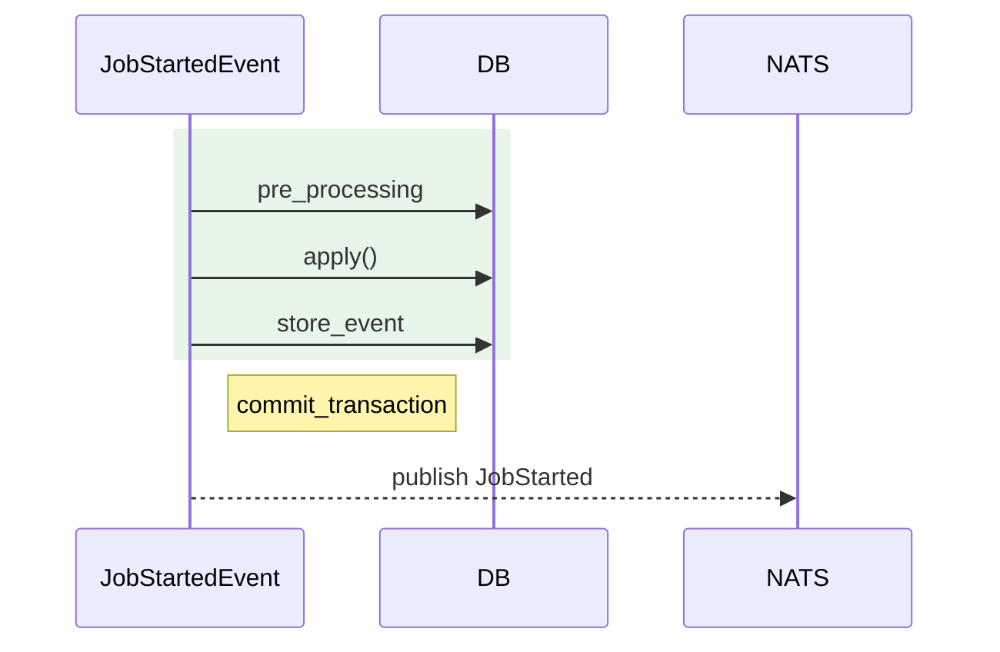
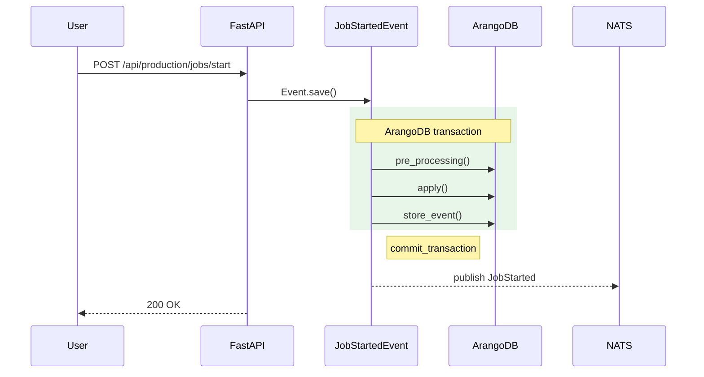
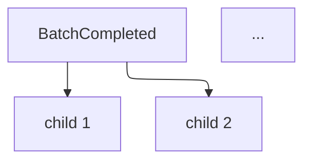

# Phase 1: Scaffold & Public Foundation — Research

**Researched:** 2026-04-29
**Domain:** OSS technical-docs site scaffold (VitePress 1.x + GitHub Pages mirror + OSS table-stakes + URL-contract locking)
**Confidence:** HIGH on tooling specifics & version pins; HIGH on existing repo state; MEDIUM on a small set of GitLab-side mirror-config items that cannot be verified from the local checkout

## Summary

This research extends `research/PITFALLS.md` (already comprehensive on the *why*) with the concrete *what-to-pin* and *what-to-paste* the planner needs to lift verbatim into PLAN.md tasks. Decisions D-01..D-15 in `01-CONTEXT.md` are locked; this document fills the gaps CONTEXT explicitly punts to the researcher (15 enumerated items in `<additional_context>`).

**Key conclusions:**

- VitePress `1.6.4` (latest stable, published 2025-08-05) is the correct pin. The 2.x line is alpha-only (`2.0.0-alpha.17`, 2026-03-19) and not used here. `[VERIFIED: npm view vitepress 2026-04-29]`
- `vitepress-plugin-mermaid` `2.0.17` (2024-09-24) accepts `vitepress: ^1.0.0 || ^1.0.0-alpha` and `mermaid: 10 || 11`. Pair with `mermaid` `^11.14.0` and `@mermaid-js/layout-elk` `^0.2.1` for ELK renderer. The plugin itself only wires Mermaid into VitePress; ELK has to be registered via `mermaid.registerLayoutLoaders(elkLayouts)` inside `mermaid.initialize` callback. `[VERIFIED: npm view + mermaid v11 docs]`
- `vitepress-openapi` `0.1.20` (2026-04-11) is current, MIT, peers `vitepress >=1.0.0` and `vue ^3.0.0`. Wired via `theme.enhanceApp({ app })` in `.vitepress/theme/index.ts`; spec loaded from `public/openapi.json`. `[CITED: github.com/enzonotario/vitepress-openapi/main/docs/guide/getting-started.md]`
- `lychee-action` v2 (`@v2`, latest v2.8.0) with `--include-fragments` flag is the anchor-aware second-pass dead-link gate Pitfall 1.4 calls for. Run against `docs/.vitepress/dist/**/*.html` after build. `[CITED: lychee.cli.rs/recipes/anchors/]`
- The local `github` git remote already points at `https://github.com/ProgressLabIT/progress-platform.git`; the GitLab→GitHub push-mirror is GitLab-side configuration, not testable from this checkout. `[VERIFIED: git remote -v]`
- The existing `LICENSE` file at repo root is MIT (22 lines); replacement with Apache 2.0 is a single-file overwrite. SPDX file headers are NOT required by Apache 2.0 — only the LICENSE file and a NOTICE file (optional but recommended) are needed. D-01 already excludes per-file SPDX headers; this confirms it. `[CITED: apache.org/legal/release-policy + opensource.guide]`
- Node `20.19.0` is consistent across the repo (`webapps/main/.nvmrc` and `webapps/warehouse/.nvmrc` both `20.19.0`); the docs site SHOULD use the same. No second toolchain. There is no root-level `.nvmrc` today — Phase 1 should add one at `docs/.nvmrc` or rely on the `setup-node` `node-version: 20.19.0` pin in the deploy workflow. `[VERIFIED: cat .nvmrc files + node --version local]`
- `cli/main.py` does NOT yet contain `progress init / restore / tap` — those are owned by the Sparkplug demo workstream (see CONTEXT D-10). The Phase 1 README "5-minute" block is a coordinated placeholder, not a working command at the time of authoring. This is consistent with CONTEXT but the planner should treat the README quickstart block as a "coordinate-with-S5" task with daily resync, not as something that can be locally verified in Phase 1. `[VERIFIED: grep -E '^@|^def|^app\.' cli/main.py]`

**Primary recommendation:** Start the phase with the four high-leverage cuts in this order: (1) delete `docs/superpowers/` (D-05) and verify VitePress owns `docs/` cleanly; (2) lock the URL contract by writing the 10 stub pages BEFORE wiring search/sitemap/openapi (so the contract is the source of truth, not the side-effect); (3) ship the GH Actions deploy + lychee gate together (deploy alone is only half the contract — without lychee on every PR, future plans drift unchecked); (4) author CONTRIBUTING.md verbatim from Pitfall 4.2 *first*, README rewrite *after* — README links into CONTRIBUTING and gets stale if CONTRIBUTING is drafted later.

## User Constraints

> Copied verbatim from `01-CONTEXT.md`. Planner MUST honor these.

### Locked Decisions

**License & OSS scaffolding**

- **D-01:** **License = Apache 2.0** (replaces existing MIT `LICENSE`). Rationale: Pitfall 4.1 — explicit patent grant for B2B/Industry-4.0 enterprise audience, contributor-friendly, AGPL-bans-friendly. Update `LICENSE` file, add `license: Apache-2.0` to any package metadata in `docs/package.json` (VitePress) and a SPDX header pattern is **not** required for v1 (post-launch tooling).
- **D-02:** **Private Vulnerability Reporting (PVR) toggle on**, plus a minimal **`SECURITY.md`** (≤15 lines) that points at PVR, states "best-effort response, no SLA", and lists the supported version as "current `DEV` only". **No 72h ack commitment** — solo-maintainer footgun. **No supported-version table** — single shipping line.
- **D-03:** **`.github/PULL_REQUEST_TEMPLATE.md`** included — explicit "direct PRs against this mirror cannot be merged; please file an issue and attach a patch" notice. This is automation, not a commitment.
- **D-04:** **No issue templates** for v1. Plain Issues form. Triage capacity is solo-maintainer; templates create overpromise. Revisit post-launch when contribution velocity warrants.

**docs/ directory layout**

- **D-05:** **`docs/superpowers/`** (existing 2-file directory) deleted early in Phase 1 (`git rm -r docs/superpowers/`). Result: VitePress owns `docs/` root with no collision.
- **D-06:** **VitePress lives at `docs/` root**, **not** `docs/site/`. Source path `docs/api/...` maps to URL path `/progress-platform/api/...` (project Pages base).

**Skeleton page strategy**

- **D-07:** Section landings + 1 representative stub each. 10 routable pages: 5 landings (`/api/`, `/events/`, `/cli/`, `/users/`, `/admins/`) + 5 stubs (`/api/production/jobs/start/`, `/events/production/job-started/`, `/cli/init/`, `/users/production/`, `/admins/deployment/`). lychee CI gate validates real cross-link patterns.
- **D-08:** URL contract = patterns + the 10 example anchors. Phase 1 locks the **shape** of every URL; Phase 2/3 fills contents.

**README rewrite & Sparkplug demo S5 coordination**

- **D-09:** Phase 1 ships full README structure per Pitfall 4.4 (≤150 lines). 8 sections in fixed order; planner may not reorder without surfacing a deviation.
- **D-10:** 5-minute `progress init` block is a **placeholder** pinned to S5's currently-locked CLI surface. Daily sync with S5. Phase 4 launch-prep does the final lock against May 14 fresh-VM rehearsal.
- **D-11:** Demo GIF / asciinema recording is Phase 4 deliverable. Phase 1 README has a placeholder image slot only.

**GitHub org / Pages URL canonical**

- **D-12:** Canonical org = **`ProgressLabIT`**. PROJECT.md / ROADMAP.md / REQUIREMENTS.md / STATE.md currently reference `progresslab` (lowercase) — corrected as a Phase 1 sub-task before any URL is hardcoded into VitePress config or success criteria.
- **D-13:** Pages URL = `https://progresslabit.github.io/progress-platform/`. VitePress `base` = `/progress-platform/`. Sitemap `hostname` = `https://progresslabit.github.io/progress-platform/`. Source-code permalink template = `https://github.com/ProgressLabIT/progress-platform/blob/<sha>/<path>` — never gitlab.com.

**CONVENTIONS.md (folded from STATE.md todo)**

- **D-14:** `.planning/workstreams/docs/CONVENTIONS.md` is authored as part of Phase 1. Initial scope: endpoint-docstring shape, AI drafting prompt scaffold, Mermaid `sequenceDiagram` transaction-boundary convention, curation-gate definition. Initial version stubs the prompt scaffold; Phase 2/3 sessions fill it in.

**Mirror push trigger (folded from STATE.md todo)**

- **D-15:** CONTRIBUTING.md mirror section explicitly documents the GitLab `Repository → Mirroring repositories → Update now` flow (Pitfall 4.7) so Phase 4's launch-day SHA-match script can rely on it. Includes the verification command `git ls-remote https://github.com/ProgressLabIT/progress-platform DEV`.

### Claude's Discretion

- **GitHub Actions workflow specifics** — concurrency `cancel-in-progress`, npm + VitePress build cache, pnpm/yarn/npm pin (researcher will check). No PR preview deploys for v1.
- **VitePress version pin** — researcher selects latest stable VitePress 1.x with confirmed `vitepress-openapi` + `vitepress-plugin-mermaid` compatibility.
- **Mermaid plugin version pin** — researcher selects an `vitepress-plugin-mermaid` version that supports both default and ELK renderer.
- **Topics set on GitHub repo** — Pitfall 4.6 list (`manufacturing`, `mes`, `iiot`, `sparkplug-b`, `industry40`, `fastapi`, `vue3`).
- **Branch protection rule details** — minimum: no force-push, no deletions on `DEV`, status checks required (Pages deploy + lychee).

### Deferred Ideas (OUT OF SCOPE)

- Custom domain `docs.progresslab.it` (Pitfall 4.8; post-launch).
- Algolia DocSearch live (POL-02; application sent in parallel; switch when approved).
- Versioned docs / per-release snapshots (POL-03).
- `/v1/` URL prefix for future versioning (rejected; root-only at v1).
- PR preview deploys (cost vs value; revisit post-launch).
- Issue templates (D-04 deferred).
- SECURITY.md SLA / supported-version table (D-02 deferred).
- Demo GIF / asciinema in Phase 1 (D-11 deferred to Phase 4).
- Sponsorship link / FUNDING.yml (no sponsorship intent for v1).
- Auto-sidebar plugin (Pitfall 1.2; post-launch).
- `Layout.vue` theme override (Pitfall 1.5; post-launch only).
- Embedded L2 docs in platform shell (EMBED-01/02; multi-week).

## Phase Requirements

| ID | Description | Research Support |
|----|-------------|------------------|
| MIR-01 | GitHub mirror configured to receive one-way push from GitLab `DEV` | Codebase Insight §A; GitLab UI flow §B; verification command §B.4 |
| MIR-02 | Mirror propagates tags | GitLab push-mirror docs (verified — tags propagate by default) §B |
| MIR-03 | GitHub repo settings: Issues on, Discussions on, Wiki off, branch protection on `DEV` | `gh repo edit` invocations §C; ruleset rule names §C.3 |
| MIR-04 | `LICENSE` file in main repo root | Apache 2.0 text source §D.1; replacement is single-file overwrite §D.1 |
| MIR-05 | `CONTRIBUTING.md` honestly explains mirror workflow | Pitfall 4.2 verbatim banner §D.2 |
| MIR-06 | `CODE_OF_CONDUCT.md` (Contributor Covenant v2.1) | URL + paste pattern §D.3 |
| MIR-07 | `README.md` mirror banner + docs-site link + quickstart pointer | 8-section structure (D-09) §D.4; placeholder for S5 quickstart §D.4 |
| SITE-01 | VitePress site initialized under `docs/` | Install + scaffold commands §E.1; `package.json` shape §E.1 |
| SITE-02 | Mermaid plugin enabled; ELK renderer available | `vitepress-plugin-mermaid` 2.0.17 + ELK loader registration §E.3 |
| SITE-03 | Hand-written `themeConfig.sidebar` | Starter `config.ts` §E.2 |
| SITE-04 | Co-located top-nav: API · Events · CLI · Users · Admins | `themeConfig.nav` array in starter `config.ts` §E.2 |
| SITE-05 | Local search via MiniSearch | `themeConfig.search.provider = 'local'` + options §E.4 |
| SITE-06 | Sitemap enabled (`sitemap.hostname`) | `sitemap.hostname` config §E.5 |
| SITE-07 | GitHub Actions builds + deploys to GH Pages on push to `DEV` | Full workflow YAML §F.1 |
| SITE-08 | Source-code permalinks point to `github.com/...` | URL template documented in CONVENTIONS.md §D.5 |
| SITE-09 | Dead-link CI job (`lychee`) on every PR | Workflow YAML §F.2 with `--include-fragments` |
| SITE-10 | URL contract locked before any markdown is written | 10-page skeleton matrix §G; sidebar entries §E.2 |
| SITE-12 | AI-drafted prose grounded in `openapi.json` (CI check enforces examples exist in OpenAPI) | `vitepress-openapi` wired against placeholder `public/openapi.json` slot §E.6; full validation script lands in Phase 2 (informational) |

## Project Constraints (from CLAUDE.md)

- **GSD Workflow Enforcement:** All file edits go through a GSD command (`/gsd:execute-phase`, etc.). The planner's tasks must reference the GSD execution flow, not direct edits.
- **Behavioral instruction:** Do not add Claude as co-author of commits.
- **Workstream Decision Records:** Cross-phase contractual decisions go in `.planning/workstreams/docs/decisions/NNNN-*.md` with status `discussion → decided → implemented → superseded`. Decisions affecting cross-session contracts (URL shape, file layout) must reach `decided` BEFORE implementation. *Recommendation:* the URL contract (D-08) and the canonical org-name correction (D-12) should land in `decisions/` as ADRs early in this phase before any markdown / config references hardcode them.
- **Naming conventions:** Backend Python = `snake_case.py`. Frontend = `kebab-case/` for component groups. Routes already use kebab-case URL segments — Phase 1 URL contract uses kebab-case (`/api/production/jobs/start/`, `/events/production/job-started/`).
- **Documentation drift:** CLAUDE.md GSD-stack/architecture blocks still reference Kafka; per project skills, treat as historical (platform is NATS). Phase 1 README rewrite must say NATS, not Kafka.
- **No Vuex / no bare `except:` / no `print()` for new code** — not phase-relevant (no backend changes), but the events/API references that *describe* this code in Phase 2/3 should not idealize patterns the codebase doesn't follow.

## Architectural Responsibility Map

| Capability | Primary Tier | Secondary Tier | Rationale |
|------------|-------------|----------------|-----------|
| Static-site rendering (Markdown → HTML) | Build-time (VitePress on GitHub Actions runner) | — | VitePress is a SSG; no server runtime; output is `dist/` HTML deployed to GH Pages CDN |
| Site delivery / CDN | CDN / Static (GitHub Pages) | — | GH Pages is static-only; no server-side redirects (Pitfall 1.8 root cause) |
| Search index | Build-time → Browser | — | MiniSearch indexes at build time, runs in browser; no server search |
| OpenAPI rendering | Build-time → Browser | — | `vitepress-openapi` ingests `public/openapi.json` at build, rendered as Vue components in-page |
| Mermaid diagrams | Browser (runtime) | Build-time (alternative: SVG bake post-launch) | `vitepress-plugin-mermaid` ships Mermaid bundle; client renders on page load |
| OSS metadata files (LICENSE, CONTRIBUTING, CODE_OF_CONDUCT, SECURITY, README, PR template) | Repo root + `.github/` | — | GitHub auto-discovers from canonical paths; not part of VitePress build |
| Deploy pipeline | GitHub Actions | — | Triggered by push to `DEV` on the GitHub mirror; not GitLab CI |
| Mirror push (GitLab → GitHub) | GitLab Repository Mirroring (GitLab-side config) | Manual `Update now` UI button (Phase 4 launch-day) | One-way push; auto every 5 min; manual force-push for SHA-match |
| Branch protection | GitHub Repository Rulesets | — | UI-configured (Settings → Rules → Rulesets) or `gh api` |
| Dead-link CI gate | GitHub Actions (lychee) | — | Runs against built `dist/` post-`vitepress build` |

## Standard Stack

### Core (production runtime + build)

| Package | Pinned Version | Purpose | Why Standard |
|---------|----------------|---------|--------------|
| `vitepress` | `1.6.4` | Static-site generator, default theme, sitemap, search | Latest stable 1.x; 2.x is alpha-only as of 2026-04-29 (`2.0.0-alpha.17`, 2026-03-19) — do NOT pin 2.x even though dist-tag `next` exists. `[VERIFIED: npm view vitepress 2026-04-29]` |
| `vue` | `^3.5.0` | Peer dependency for VitePress 1.x and vitepress-openapi 0.1.x | Required peer; bundled as transitive of VitePress |
| `vitepress-plugin-mermaid` | `2.0.17` | Mermaid diagrams in markdown fences | Pitfall 3.4; only mature option; peers `vitepress: ^1.0.0`, `mermaid: 10 || 11` `[VERIFIED: npm view 2026-04-29]` |
| `mermaid` | `^11.14.0` | Diagram rendering engine | Latest stable 11.x; required by plugin; needed for ELK loader API `[VERIFIED: npm view mermaid 2026-04-29]` |
| `@mermaid-js/layout-elk` | `^0.2.1` | ELK layout engine for `>20 nodes` / `>2 subgraph` diagrams | Pitfall 3.3; in Mermaid 11 ELK was extracted to a separate package `[CITED: github.com/mermaid-js/mermaid issue #5969 + npm @mermaid-js/layout-elk]` |
| `vitepress-openapi` | `0.1.20` | Inline API rendering (replaces Swagger-iframe) | Pitfall 1.1 + locked decision in STATE.md; published 2026-04-11; peers `vitepress >=1.0.0`, `vue ^3.0.0` `[VERIFIED: npm view 2026-04-29]` |

**Versions pinned exact (no `^`) for `vitepress`, `vitepress-plugin-mermaid`, `vitepress-openapi`** to avoid surprise minor bumps mid-launch window. `mermaid` and `@mermaid-js/layout-elk` use `^` (caret) since they're under the plugin's API surface and minor patches are safe. `vue` uses `^` to track VitePress's own peer.

### Supporting (CI + scripts)

| Tool | Version / Pin | Purpose |
|------|---------------|---------|
| `lycheeverse/lychee-action` | `@v2` (latest tag = `v2.8.0`, 2026-02-25) | Anchor-aware dead-link CI; `--include-fragments` flag enables hash-fragment validation `[CITED: lychee.cli.rs/recipes/anchors/]` |
| `actions/checkout` | `@v5` | Repo checkout |
| `actions/setup-node` | `@v6` (latest as of VitePress official deploy sample) `[CITED: vitepress.dev/guide/deploy]` |
| `actions/configure-pages` | `@v4` | GH Pages config |
| `actions/upload-pages-artifact` | `@v3` | Build artifact upload |
| `actions/deploy-pages` | `@v4` | GH Pages deploy |
| `gh` CLI | (already installed locally `2.89.0`) | Repo settings via `gh repo edit` and `gh api` |

### Alternatives Considered

| Instead of | Could Use | Tradeoff (rejected for Phase 1) |
|------------|-----------|----------------------------------|
| `vitepress-plugin-mermaid` | `vitepress-plugin-diagrams` (build-time SVG cache) | Faster pages, no dark-mode toggle support; Pitfall 3.4 explicitly defers this to post-launch |
| `vitepress-openapi` | Swagger UI iframe | Pitfall 1.1 — loses search, theming, routing; rejected |
| MiniSearch | Algolia DocSearch | Pitfall 1.3 — application queue; ship MiniSearch v1, switch when approved |
| `lychee` | VitePress built-in dead-link checker | Pitfall 1.4 — built-in skips fragments; lychee is mandatory second pass |
| `pnpm` / `yarn` for VitePress | `npm` | Webapps use `yarn` but the docs site is *isolated* under `docs/`; `npm` is GitHub Actions default and the VitePress official sample uses `npm ci` + `npm run docs:build`. **Recommendation: use `npm` for `docs/` only.** A `docs/package-lock.json` lockfile lives next to `docs/package.json`; webapps still use `yarn.lock` at root. No conflict. |

**Installation (one-shot, run from `docs/`):**

```bash
# from repo root
mkdir -p docs && cd docs
npm init -y
npm install --save-dev \
  vitepress@1.6.4 \
  vitepress-plugin-mermaid@2.0.17 \
  vitepress-openapi@0.1.20 \
  mermaid@^11.14.0 \
  @mermaid-js/layout-elk@^0.2.1
# vue is brought in transitively via vitepress; no explicit install needed
```

Add to `docs/package.json`:

```json
{
  "name": "@progresslab/progress-platform-docs",
  "private": true,
  "license": "Apache-2.0",
  "engines": { "node": "20.19.0" },
  "scripts": {
    "docs:dev": "vitepress dev .",
    "docs:build": "vitepress build .",
    "docs:preview": "vitepress preview ."
  }
}
```

**`docs/.gitignore` content:**

```
node_modules/
.vitepress/cache/
.vitepress/dist/
```

## Architecture Patterns

### System Architecture Diagram

```
                                  GitLab (canonical)
                                       │
                                       │ push-mirror (auto: 5 min, manual: Update now)
                                       ▼
                              GitHub mirror: ProgressLabIT/progress-platform
                                  ┌────┴─────────────────┐
                                  │ push to DEV          │ on every PR
                                  ▼                      ▼
                  ┌───────────────────────┐    ┌────────────────────────┐
                  │ GH Action: deploy.yml │    │ GH Action: lychee.yml  │
                  │  - checkout           │    │  - checkout            │
                  │  - setup-node 20.19.0 │    │  - setup-node 20.19.0  │
                  │  - npm ci             │    │  - npm ci              │
                  │  - vitepress build    │    │  - vitepress build     │
                  │  - upload-pages-artifact │    │  - lychee --include-fragments dist/**/*.html │
                  └───────┬───────────────┘    └────────────────────────┘
                          │
                          ▼
                  ┌───────────────────────┐
                  │ GH Pages CDN          │
                  │ progresslabit.github.io/progress-platform/ │
                  └───────────────────────┘

Build-time graph (inside vitepress build):
  docs/.vitepress/config.ts ──► VitePress core
                                 ├─► withMermaid wrapper (vitepress-plugin-mermaid)
                                 │     └─► Mermaid 11 + @mermaid-js/layout-elk (registered in mermaid init)
                                 ├─► sitemap.hostname → /sitemap.xml
                                 └─► themeConfig: nav, sidebar (HAND-WRITTEN), search.provider='local'
  docs/.vitepress/theme/index.ts ──► extends DefaultTheme
                                       ├─► useOpenapi({ spec: import('public/openapi.json') })
                                       └─► theme.enhanceApp({ app })  // vitepress-openapi
  docs/public/openapi.json ──► Phase 1 placeholder; populated by Phase 2 export script
  docs/api/, docs/events/, docs/cli/, docs/users/, docs/admins/ ──► markdown
```

Component responsibilities:

| Component | File | Responsibility |
|-----------|------|----------------|
| Site config | `docs/.vitepress/config.ts` | `base`, `lang`, `title`, `description`, `themeConfig.nav`, `themeConfig.sidebar`, `themeConfig.search`, `sitemap`, `markdown.lineNumbers`, mermaid init |
| Theme extension | `docs/.vitepress/theme/index.ts` | Extend default theme; register `vitepress-openapi`; load `public/openapi.json` |
| OpenAPI spec slot | `docs/public/openapi.json` | Phase 1: minimal valid placeholder. Phase 2: populated from `scripts/export_openapi.py` |
| Static assets | `docs/public/` | `robots.txt`, future `llms.txt` (Pitfall 5.5, post-launch) |
| Custom CSS | `docs/.vitepress/theme/custom.css` | Single brand color via CSS variable `--vp-c-brand-1` (Pitfall 1.5 — no Layout override) |
| Top-nav landing pages | `docs/api/index.md`, `docs/events/index.md`, `docs/cli/index.md`, `docs/users/index.md`, `docs/admins/index.md` | One-line "Coming soon" + heading; landing page for the section |
| Representative stubs | `docs/api/production/jobs/start.md`, `docs/events/production/job-started.md`, `docs/cli/init.md`, `docs/users/production.md`, `docs/admins/deployment.md` | One-line "Coming soon — Phase 2/3" frontmatter + visible heading |

### §A — Existing repository state (verified at research time)

| Item | State (verified) | Action for Phase 1 |
|------|------------------|---------------------|
| `LICENSE` | MIT, 22 lines, copyright "Progress Platform Contributors" | Replace with Apache 2.0 (single overwrite) |
| `README.md` | Architecture-wall (~234 lines) — well-written but mis-targeted for OSS visitor | Rewrite per Pitfall 4.4 8-section structure; extract architecture content to `ARCHITECTURE.md` |
| `docs/superpowers/` | 2 files: `plans/2026-04-15-custom-data.md`, `specs/2026-04-15-custom-data-design.md` | `git rm -r docs/superpowers/` (D-05) |
| `git remote -v` | `github → https://github.com/ProgressLabIT/progress-platform.git`; `origin → https://gitlab.com/progresslab/progress-platform` | Local `github` remote already correct. NO action needed at the local-remote layer. |
| `webapps/main/.nvmrc` and `webapps/warehouse/.nvmrc` | Both `20.19.0` | Reuse same Node version for docs CI |
| Root-level `.nvmrc` | Does NOT exist | Optional: add at `docs/.nvmrc` for docs subtree |
| `.github/` | Does NOT exist | Phase 1 creates `.github/workflows/deploy-docs.yml`, `.github/workflows/lychee.yml`, `.github/PULL_REQUEST_TEMPLATE.md` |
| `SECURITY.md`, `CONTRIBUTING.md`, `CODE_OF_CONDUCT.md` at root | None exist | Phase 1 creates all three |
| `cli/main.py` | Contains `reset_production_and_traceability_data`, `generate_random_wos`, `set_progress` — does NOT contain `init / restore / tap` | README "5-minute" block is a placeholder pinned to S5's locked CLI (D-10), not testable in this repo at Phase 1 time |
| `.gitlab-ci.yml` | Tag-triggered Docker build pipeline (`v*.*.*`) | Phase 1 leaves this UNCHANGED. The mirror push is GitLab UI config, not `.gitlab-ci.yml` |
| `node`, `npm` available in dev env | `node 20.19.0`, `npm 10.8.2` | Aligned with webapps |

### §B — GitLab → GitHub mirror configuration

The `github` git remote on the local checkout is just a name; it doesn't create the GitLab-side push mirror. **GitLab Repository Mirroring is configured server-side in the GitLab project settings.** This is a one-time setup and cannot be verified from this repo checkout.

**1. Configuration UI flow (one-time admin):** `[CITED: docs.gitlab.com/user/project/repository/mirror/push/]`

```
GitLab project (gitlab.com/progresslab/progress-platform)
  → Settings
  → Repository
  → Mirroring repositories (expand)
  → Add new
    Git repository URL: https://github.com/ProgressLabIT/progress-platform.git
    Mirror direction: Push
    Authentication method: Password
    Username: <github-username>
    Password: <github fine-grained PAT — see §B.2>
    [✓] Only mirror protected branches  (recommended — pushes only DEV + tag-protected branches)
    [✓] Keep divergent refs  (off — overwrite)
  → Mirror repository
```

**2. Required GitHub PAT scopes (fine-grained):**

- Repository contents: read & write
- Workflows: read & write (the mirror itself doesn't push workflows — `deploy-docs.yml` and `lychee.yml` are pushed via the mirror, so the PAT must have workflow scope or those files won't propagate)

**3. Tag propagation:** verified — push mirroring includes tags by default `[CITED: docs.gitlab.com/user/project/repository/mirror/push]`. Existing GitLab CI tag-trigger pattern (`v*.*.*` per `.gitlab-ci.yml`) is preserved.

**4. Manual force-push trigger ("Update now"):** the half-circle-arrows icon next to the mirror entry. This is the Phase 4 launch-day mechanism (referenced in CONTRIBUTING.md per D-15).

**5. Verification command (from any maintainer's machine):**

```bash
# both must resolve to the same SHA
git ls-remote https://gitlab.com/progresslab/progress-platform DEV | awk '{print $1}'
git ls-remote https://github.com/ProgressLabIT/progress-platform DEV | awk '{print $1}'
```

This is the verification command that lands in CONTRIBUTING.md (D-15) and is the basis for Phase 4's `scripts/verify_mirror.sh`.

**Confidence:** HIGH on the UI path (verified against current GitLab docs); MEDIUM on whether the mirror is *already configured*. The local `github` remote points at `ProgressLabIT/progress-platform.git`, but that's just a developer convenience — it doesn't tell us whether the GitLab-side push-mirror is already wired. **Planner action:** include a Phase 1 task that asks the maintainer to verify GitLab's mirror config (one click in GitLab UI, observe the green sync indicator).

### §C — GitHub repo settings via `gh` CLI

`gh` `2.89.0` is available locally. Repo settings can be set scriptably (not just via UI):

#### §C.1 — Topics, description, homepage

```bash
gh repo edit ProgressLabIT/progress-platform \
  --description "Manufacturing Operations Management platform — event-sourced MES on FastAPI + ArangoDB + Vue 3" \
  --homepage "https://progresslabit.github.io/progress-platform/" \
  --add-topic manufacturing \
  --add-topic mes \
  --add-topic iiot \
  --add-topic sparkplug-b \
  --add-topic industry40 \
  --add-topic fastapi \
  --add-topic vue3
```

#### §C.2 — Toggles (Issues / Discussions / Wiki / PVR)

```bash
# Issues + Discussions on, Wiki off
gh repo edit ProgressLabIT/progress-platform \
  --enable-issues \
  --enable-discussions \
  --enable-wiki=false

# Private Vulnerability Reporting on (via REST API; gh repo edit lacks a flag)
gh api -X PATCH /repos/ProgressLabIT/progress-platform/private-vulnerability-reporting \
  -F enabled=true
```

The PVR API endpoint is documented; alternative manual UI path: `Settings → Code security and analysis → Private vulnerability reporting → Enable`. `[CITED: docs.github.com/en/code-security/security-advisories/working-with-repository-security-advisories/configuring-private-vulnerability-reporting-for-a-repository]`

#### §C.3 — Branch protection ruleset on `DEV`

GitHub's modern protection mechanism is **Repository Rulesets** (UI: `Settings → Rules → Rulesets → New ruleset`). The exact rule names as they appear in the current UI: `[VERIFIED: docs.github.com/en/repositories/configuring-branches-and-merges-in-your-repository/managing-rulesets/available-rules-for-rulesets]`

| Phase 1 requirement | Ruleset rule name (verbatim) |
|---------------------|------------------------------|
| No force-push | **Block force pushes** |
| No deletions | **Restrict deletions** |
| Status checks required | **Require status checks to pass before merging** |

Recommended ruleset config (UI walkthrough):

1. `Settings` → `Rules` → `Rulesets` → `New ruleset` → `New branch ruleset`
2. **Ruleset name:** `protect-main`
3. **Enforcement status:** Active
4. **Target branches:** Include default branch (`DEV`)
5. **Branch rules** (check these):
   - [✓] Restrict deletions
   - [✓] Block force pushes
   - [✓] Require status checks to pass before merging
     - Add: `Deploy VitePress site to Pages / build` (the workflow job name)
     - Add: `lychee dead-link check / linkChecker` (the workflow job name)
6. (Leave `Require a pull request before merging` UNCHECKED — pushes to mirror `DEV` come from GitLab; PRs against the mirror cannot be merged anyway per D-03/MIR-05.)
7. Save

**Or scriptably via API** (more reliable for repeatable plans):

```bash
gh api -X POST /repos/ProgressLabIT/progress-platform/rulesets \
  -H "Accept: application/vnd.github+json" \
  --input - <<'JSON'
{
  "name": "protect-main",
  "target": "branch",
  "enforcement": "active",
  "conditions": {
    "ref_name": { "include": ["~DEFAULT_BRANCH"], "exclude": [] }
  },
  "rules": [
    { "type": "deletion" },
    { "type": "non_fast_forward" },
    {
      "type": "required_status_checks",
      "parameters": {
        "strict_required_status_checks_policy": false,
        "required_status_checks": [
          { "context": "build" },
          { "context": "linkChecker" }
        ]
      }
    }
  ]
}
JSON
```

(Job names `build` and `linkChecker` come from the workflow files in §F.)

### §D — OSS table-stakes file content patterns

#### §D.1 — `LICENSE` (Apache 2.0)

The Apache 2.0 license text is canonical and unmodified:

- Source: https://www.apache.org/licenses/LICENSE-2.0.txt (plain-text version, copy verbatim)
- Length: ~202 lines
- Copyright line at the bottom of the boilerplate APPENDIX is the only customizable part: leave the boilerplate unchanged but DON'T paste the boilerplate-as-comment-header section into source files (D-01: SPDX headers not required for v1).
- **NOTICE file:** Apache 2.0 doesn't *require* a NOTICE file unless the project bundles third-party Apache 2.0 code requiring attribution; for a fresh license adoption with no Apache-licensed forks, a NOTICE file is optional. **Recommendation: skip NOTICE for v1**, revisit if a vendored Apache 2.0 dependency is introduced. `[CITED: apache.org/legal/release-policy.html#license-and-notice]`

#### §D.2 — `CONTRIBUTING.md` (verbatim from Pitfall 4.2 + D-15)

```markdown
# Contributing to Progress Platform

Progress Platform's canonical home is GitLab at `https://gitlab.com/progresslab/progress-platform`. **GitHub is a read-only mirror** maintained for discoverability.

We accept contributions through:

1. **GitHub Issues** — bug reports and feature requests. Maintainers triage and may file the corresponding work item on internal GitLab.
2. **GitHub Discussions** — questions and design conversations.
3. **Patches** — please open an issue first; for code contributions, attach a patch to the issue. Direct PRs against the mirror cannot be merged here and will be closed with a pointer to the issue flow.

We expect to revisit this flow once contribution velocity warrants a full GitLab→GitHub migration.

## Mirror update flow (for maintainers)

The GitLab → GitHub push-mirror runs automatically every 5 minutes. To force-push immediately:

1. Open GitLab: **Settings → Repository → Mirroring repositories**
2. Click the **Update now** button (half-circle arrows icon) next to the GitHub mirror entry.

To verify mirror sync, run from any machine:

```bash
git ls-remote https://gitlab.com/progresslab/progress-platform DEV
git ls-remote https://github.com/ProgressLabIT/progress-platform DEV
```

Both must resolve to the same SHA.
```

#### §D.3 — `CODE_OF_CONDUCT.md` (Contributor Covenant v2.1)

Source URL: https://www.contributor-covenant.org/version/2/1/code_of_conduct/code_of_conduct.md `[CITED: contributor-covenant.org]`

Replace placeholders:
- `[INSERT CONTACT METHOD]` → "open an issue at https://github.com/ProgressLabIT/progress-platform/issues" (NOT an email; D-02 punts the security@progresslab.it alias to optional).

#### §D.4 — `README.md` (rewrite per Pitfall 4.4 + D-09)

Cap: ~150 lines. 8 sections in fixed order:

```markdown
# Progress Platform

[](LICENSE)
[](https://progresslabit.github.io/progress-platform/)
[](https://github.com/ProgressLabIT/progress-platform/releases)
[](https://github.com/ProgressLabIT/progress-platform/discussions)

> **Manufacturing Operations Management** for discrete manufacturing — event-sourced, on-premise, single-tenant.
> Production tracking, inventory, traceability, quality. FastAPI + ArangoDB + Vue 3 + NATS.

> ⚠️ **This is a read-only mirror.** Canonical: [GitLab](https://gitlab.com/progresslab/progress-platform). See [CONTRIBUTING.md](CONTRIBUTING.md).

<!-- Phase 4 deliverable: replace with asciinema/SVG of `progress init` (D-11) -->


## Try it in 5 minutes

> **Note:** the `progress` CLI is part of the Sparkplug demo bundle, in active development. Daily-locked surface as of <date>:

```bash
# placeholder — coordinated with sparkplug-demo workstream
curl -fsSL https://progresslabit.github.io/progress-platform/install.sh | sh
progress init
progress restore --demo sparkplug
progress tap
# open http://progress.localhost
```

## Documentation

Full docs: **https://progresslabit.github.io/progress-platform/**

- API reference (every public endpoint, parameters, errors, emitted events)
- Events reference (50+ events; top 10 with sequence diagrams)
- CLI reference (`progress init`, `progress restore`, `progress tap`)
- User walkthroughs (production, inventory, counting, warehouse)
- Admin / integrator docs (deployment, configuration, NATS taxonomy)

## Architecture (1-paragraph)

Event-sourced backend (FastAPI + Pydantic v2) on ArangoDB (multi-model: documents + graph). Inter-service messaging via NATS JetStream. Frontends: Vue 3 + Quasar 2 (main desktop SPA + warehouse mobile app). Workflows on Prefect 3. Single-tenant, on-premise via Docker. See [ARCHITECTURE.md](ARCHITECTURE.md) for layer details.

## Contributing

GitHub is a read-only mirror — direct PRs cannot be merged. Open an issue or discussion. See [CONTRIBUTING.md](CONTRIBUTING.md) and [CODE_OF_CONDUCT.md](CODE_OF_CONDUCT.md).

## Security

Found a vulnerability? Use [GitHub Private Vulnerability Reporting](https://github.com/ProgressLabIT/progress-platform/security/advisories/new). See [SECURITY.md](SECURITY.md).

## License

Apache 2.0 — see [LICENSE](LICENSE).
```

Notes:
- Status badges use shields.io (no external account needed).
- Mirror banner is the second block — visitor sees it within the first viewport.
- `ARCHITECTURE.md` is a NEW file extracted from the current `README.md` architecture content (lines 9–35 of current README — diagram + key design decisions). Phase 1 sub-task: extract.
- Demo image is a placeholder; real asset captured in Phase 4 per D-11.

#### §D.5 — `SECURITY.md` (≤15 lines, per D-02)

```markdown
# Security Policy

Progress Platform is maintained by a small team. We treat security reports seriously but cannot commit to formal SLAs at this stage.

## Reporting a vulnerability

Please use [GitHub Private Vulnerability Reporting](https://github.com/ProgressLabIT/progress-platform/security/advisories/new). This delivers the report directly to the maintainers without making it public.

We will respond on a best-effort basis. There is no committed acknowledgment window at this time.

## Supported version

Only the current `DEV` branch (latest tag) is supported. We do not backport security fixes to earlier releases.
```

(11 lines of body content, well under the ≤15-line cap.)

#### §D.6 — `.github/PULL_REQUEST_TEMPLATE.md` (per D-03)

```markdown
> ⚠️ **This repository is a read-only mirror.** Direct pull requests against this mirror cannot be merged.
>
> Please:
> 1. Open an [issue](../../issues) describing the change you'd like to make.
> 2. Attach a patch (`git format-patch`) or a URL to a public branch we can pull from.
>
> See [CONTRIBUTING.md](../CONTRIBUTING.md) for details. We expect to revisit this flow as contribution velocity warrants.
```

GitHub renders this template in every new-PR form. Closing the PR with a link to the issue flow is a manual maintainer action; no automation in v1 (D-04 — no triage automation).

### §E — VitePress configuration

#### §E.1 — Initialization (manual, NOT `vitepress init`)

The `vitepress init` wizard creates a sample structure but pollutes the `docs/` root with a sample `index.md`, `markdown-examples.md`, etc. **Do not run `vitepress init`.** Instead, hand-author `docs/.vitepress/config.ts` and the 10 stub pages directly. This avoids the deletion churn the wizard creates.

#### §E.2 — Starter `docs/.vitepress/config.ts` (concrete)

```typescript
// docs/.vitepress/config.ts
import { defineConfig } from 'vitepress'
import { withMermaid } from 'vitepress-plugin-mermaid'

export default withMermaid(defineConfig({
  // ─── Site identity ────────────────────────────────────────
  lang: 'en-US',
  title: 'Progress Platform',
  description: 'Manufacturing Operations Management — event-sourced MES on FastAPI + ArangoDB + Vue 3.',
  base: '/progress-platform/',  // D-13: GH Pages project base
  cleanUrls: true,              // /api/production/jobs/start/ instead of .html
  lastUpdated: true,
  ignoreDeadLinks: false,       // Pitfall 1.4: do NOT silence (let lychee catch fragments separately)

  // ─── SEO / discoverability ───────────────────────────────
  sitemap: {
    hostname: 'https://progresslabit.github.io/progress-platform/',  // D-13
  },

  head: [
    ['link', { rel: 'icon', href: '/progress-platform/favicon.ico' }],
    ['meta', { name: 'theme-color', content: '#0066cc' }],
  ],

  // ─── Markdown ─────────────────────────────────────────────
  markdown: {
    lineNumbers: true,           // Pitfall 1.6
    // Mermaid is wired via withMermaid() wrapper above
  },

  // ─── Theme (default theme + minimal overrides) ───────────
  themeConfig: {
    siteTitle: 'Progress Platform',

    // Top-nav (D-07: 5 sections in fixed order)
    nav: [
      { text: 'API', link: '/api/' },
      { text: 'Events', link: '/events/' },
      { text: 'CLI', link: '/cli/' },
      { text: 'Users', link: '/users/' },
      { text: 'Admins', link: '/admins/' },
    ],

    // Hand-written sidebar (Pitfall 1.2: NO auto-sidebar plugin)
    sidebar: {
      '/api/': [
        { text: 'API Reference', items: [
          { text: 'Overview', link: '/api/' },
          { text: 'production: jobs/start', link: '/api/production/jobs/start' },
          // Phase 2: full enumeration appended
        ]},
      ],
      '/events/': [
        { text: 'Events Reference', items: [
          { text: 'Overview', link: '/events/' },
          { text: 'production: JobStarted', link: '/events/production/job-started' },
          // Phase 2: top-10 + auto-extracted appended
        ]},
      ],
      '/cli/': [
        { text: 'CLI Reference', items: [
          { text: 'Overview', link: '/cli/' },
          { text: 'progress init', link: '/cli/init' },
          // Phase 3: restore, tap appended
        ]},
      ],
      '/users/': [
        { text: 'User Documentation', items: [
          { text: 'Overview', link: '/users/' },
          { text: 'Production', link: '/users/production' },
          // Phase 3: inventory, counting, user-hub, warehouse appended
        ]},
      ],
      '/admins/': [
        { text: 'Admin & Integrator', items: [
          { text: 'Overview', link: '/admins/' },
          { text: 'Deployment', link: '/admins/deployment' },
          // Phase 3: configuration, integrations, operations appended
        ]},
      ],
    },

    // MiniSearch local search (Pitfall 1.3, D-locked)
    search: {
      provider: 'local',
      options: {
        detailedView: true,
        miniSearch: {
          searchOptions: {
            fuzzy: 0.2,
            prefix: true,
            boost: { title: 4, text: 2, titles: 1 },
          },
        },
      },
    },

    // Footer
    socialLinks: [
      { icon: 'github', link: 'https://github.com/ProgressLabIT/progress-platform' },
      { icon: 'gitlab', link: 'https://gitlab.com/progresslab/progress-platform' },
    ],
    footer: {
      message: 'Released under the Apache 2.0 License.',
      copyright: 'Copyright © 2026 Progress Platform Contributors.',
    },

    // Source-code edit links (D-13: github.com/ProgressLabIT, never gitlab)
    editLink: {
      pattern: 'https://github.com/ProgressLabIT/progress-platform/edit/DEV/docs/:path',
      text: 'Edit this page on GitHub',
    },
  },

  // ─── Mermaid (vitepress-plugin-mermaid wrapper config) ───
  mermaid: {
    // Default theme; per-diagram %%{init:{theme:'dark'}}%% if needed
    theme: 'default',
  },
  mermaidPlugin: {
    class: 'mermaid my-mermaid',
  },
}))
```

#### §E.3 — `docs/.vitepress/theme/index.ts` (vitepress-openapi + ELK loader)

```typescript
// docs/.vitepress/theme/index.ts
import DefaultTheme from 'vitepress/theme'
import type { Theme } from 'vitepress'
import { theme as openapiTheme, useOpenapi } from 'vitepress-openapi/client'
import 'vitepress-openapi/dist/style.css'
import './custom.css'  // brand color CSS variable

import mermaid from 'mermaid'
import elkLayouts from '@mermaid-js/layout-elk'

// Phase 1: load placeholder spec; Phase 2 swaps in the real export
import spec from '../public/openapi.json' with { type: 'json' }

// Register ELK loader so diagrams with `layout: elk` render correctly
// (Pitfall 3.3: >20 nodes / >2 subgraph levels)
if (typeof window !== 'undefined') {
  mermaid.registerLayoutLoaders(elkLayouts)
}

export default {
  extends: DefaultTheme,
  async enhanceApp({ app }) {
    useOpenapi({ spec })
    openapiTheme.enhanceApp({ app })
  },
} satisfies Theme
```

`docs/.vitepress/theme/custom.css`:

```css
:root {
  --vp-c-brand-1: #0066cc;
  --vp-c-brand-2: #0080ff;
  --vp-c-brand-3: #3399ff;
}
```

#### §E.4 — Placeholder `docs/public/openapi.json` (Phase 1)

The `vitepress-openapi` plugin requires a valid spec to import without erroring. Phase 1 ships a minimal placeholder; Phase 2 replaces it with the real `app.openapi()` export.

```json
{
  "openapi": "3.0.4",
  "info": {
    "title": "Progress Platform API",
    "version": "0.0.0-placeholder",
    "description": "Placeholder — populated in Phase 2 from `scripts/export_openapi.py`."
  },
  "paths": {}
}
```

(An empty `paths` object is valid OpenAPI 3.x; `vitepress-openapi` renders a "no operations" empty state.)

#### §E.5 — `docs/public/robots.txt`

```
User-agent: *
Allow: /

Sitemap: https://progresslabit.github.io/progress-platform/sitemap.xml
```

#### §E.6 — Mermaid ELK usage pattern (for Phase 2 diagrams; documented now)

Per-diagram opt-in (Mermaid 11 frontmatter syntax):

````markdown

````

ELK is opt-in per-diagram; default Dagre is used otherwise. The `if (typeof window !== 'undefined')` guard in §E.3 prevents SSR errors during `vitepress build`.

### §F — GitHub Actions workflows

#### §F.1 — `.github/workflows/deploy-docs.yml` (build + deploy to GH Pages)

```yaml
# .github/workflows/deploy-docs.yml
name: Deploy VitePress site to Pages

on:
  push:
    branches: [DEV]
    paths:
      - 'docs/**'
      - '.github/workflows/deploy-docs.yml'
  workflow_dispatch:

permissions:
  contents: read
  pages: write
  id-token: write

# Allow only one concurrent deployment; queue but don't cancel mid-flight
concurrency:
  group: pages
  cancel-in-progress: false

jobs:
  build:
    runs-on: ubuntu-latest
    defaults:
      run:
        working-directory: docs
    steps:
      - name: Checkout
        uses: actions/checkout@v5
        with:
          fetch-depth: 0   # needed for lastUpdated: true

      - name: Setup Node
        uses: actions/setup-node@v6
        with:
          node-version: 20.19.0
          cache: npm
          cache-dependency-path: docs/package-lock.json

      - name: Setup Pages
        uses: actions/configure-pages@v4

      - name: Cache VitePress build
        uses: actions/cache@v4
        with:
          path: docs/.vitepress/cache
          key: vitepress-${{ runner.os }}-${{ hashFiles('docs/package-lock.json', 'docs/.vitepress/config.ts') }}
          restore-keys: |
            vitepress-${{ runner.os }}-

      - name: Install dependencies
        run: npm ci

      - name: Build with VitePress
        run: npm run docs:build

      - name: Upload artifact
        uses: actions/upload-pages-artifact@v3
        with:
          path: docs/.vitepress/dist

  deploy:
    needs: build
    runs-on: ubuntu-latest
    environment:
      name: github-pages
      url: ${{ steps.deployment.outputs.page_url }}
    steps:
      - name: Deploy to GitHub Pages
        id: deployment
        uses: actions/deploy-pages@v4
```

Notes:
- `concurrency.cancel-in-progress: false` matches VitePress official guidance — don't cancel an in-flight Pages deploy (creates partial-deploy artifacts).
- `paths:` filter prevents docs deploys on backend-only PRs (saves Action minutes).
- `cache-dependency-path` keeps the npm cache scoped to `docs/package-lock.json` (yarn.lock at repo root is unrelated).
- `actions/cache@v4` for VitePress build cache halves cold builds on 100+ page sites — minimal impact at 10 pages but it's free to add now.
- `fetch-depth: 0` is needed when `lastUpdated: true` (which we set) so VitePress can read git history for last-modified timestamps.
- Build target time: under 10 minutes (success criterion 4 in ROADMAP). 10 pages + plugins build in well under 1 minute on `ubuntu-latest`.

#### §F.2 — `.github/workflows/lychee.yml` (dead-link CI gate per PR)

```yaml
# .github/workflows/lychee.yml
name: lychee dead-link check

on:
  pull_request:
    paths:
      - 'docs/**'
      - '.github/workflows/lychee.yml'
  push:
    branches: [DEV]
    paths:
      - 'docs/**'

jobs:
  linkChecker:
    runs-on: ubuntu-latest
    permissions:
      contents: read
    steps:
      - name: Checkout
        uses: actions/checkout@v5

      - name: Setup Node
        uses: actions/setup-node@v6
        with:
          node-version: 20.19.0
          cache: npm
          cache-dependency-path: docs/package-lock.json

      - name: Install
        working-directory: docs
        run: npm ci

      - name: Build with VitePress
        working-directory: docs
        run: npm run docs:build

      - name: lychee link check (anchor-aware)
        uses: lycheeverse/lychee-action@v2
        with:
          # Pitfall 1.4: --include-fragments enables hash-anchor validation,
          # which VitePress's built-in checker silently skips.
          args: >-
            --no-progress
            --include-fragments
            --root-dir "${{ github.workspace }}/docs/.vitepress/dist"
            --base "https://progresslabit.github.io/progress-platform/"
            --exclude "^https?://(?:localhost|127\\.0\\.0\\.1|progress\\.localhost)"
            "docs/.vitepress/dist/**/*.html"
          fail: true
          jobSummary: true
```

Notes:
- `lychee-action@v2` (latest tag `v2.8.0`, 2026-02-25). For supply-chain hardening, post-launch consider switching to a SHA pin (`@7da8ec1f...`) per lychee's own recommendation.
- `--include-fragments` is the *whole point* of lychee here — without it, VitePress's built-in dead-link check would suffice.
- `--root-dir` lets lychee resolve relative paths against the built dist.
- `--base` lets lychee canonicalize internal absolute links beginning with `/progress-platform/...` (the configured `base`) to local `dist/` files.
- `--exclude` skips `localhost` patterns that the README dev-stack sample contains (those will exist in code blocks).
- `fail: true` makes the workflow fail on broken links — required for branch protection (status check).

### §G — URL contract: 10 stub pages (Phase 1 deliverable)

The contract is the source of truth. Plan creates exactly these 10 markdown files (no more, no less, in Phase 1):

| File path | URL (with `base: /progress-platform/`) | Stub purpose |
|-----------|----------------------------------------|--------------|
| `docs/index.md` | `/progress-platform/` | Homepage with title + 5-link section overview |
| `docs/api/index.md` | `/progress-platform/api/` | API section landing |
| `docs/api/production/jobs/start.md` | `/progress-platform/api/production/jobs/start/` | Representative endpoint stub |
| `docs/events/index.md` | `/progress-platform/events/` | Events section landing |
| `docs/events/production/job-started.md` | `/progress-platform/events/production/job-started/` | Representative event stub |
| `docs/cli/index.md` | `/progress-platform/cli/` | CLI section landing |
| `docs/cli/init.md` | `/progress-platform/cli/init/` | Representative CLI command stub |
| `docs/users/index.md` | `/progress-platform/users/` | Users section landing |
| `docs/users/production.md` | `/progress-platform/users/production/` | Representative user-area stub |
| `docs/admins/index.md` | `/progress-platform/admins/` | Admin section landing |
| `docs/admins/deployment.md` | `/progress-platform/admins/deployment/` | Representative admin stub |

Stub frontmatter pattern (uniform across all 10):

```markdown
---
title: <Section/Stub name>
description: <one-line description>
---

# <Section/Stub name>

> 🚧 Coming soon — populated in Phase 2/3.

This page is a Phase 1 scaffold; the URL is locked. Content lands when [Phase <2 or 3>] of the docs workstream completes.

<!-- Cross-reference exercise (lychee gate validates these in CI) -->

Related: [Events](/events/) · [API](/api/) · [Home](/)
```

The cross-references are deliberately included so that the lychee CI gate exercises real link-resolution patterns and any sidebar mis-key is caught immediately, not in Phase 2.

### §H — `.planning/workstreams/docs/CONVENTIONS.md` initial scope (D-14)

Phase 1 stubs this file; Phase 2/3 populate. Initial sections (one paragraph each, plus stub):

1. **Endpoint docstring shape** — copy from Pitfall 2.1 example (one-line summary + multi-line markdown description with **Emits:** and **Required scope:** at the bottom).
2. **AI drafting prompt scaffold** — copy from Pitfall 5.3 verbatim. Mark as "STUB — refined per-section in Phase 2/3".
3. **Mermaid `sequenceDiagram` transaction-boundary convention** — copy from Pitfall 3.2: `rect rgb(232, 245, 233)` around `pre_processing` + `apply` + `store_event`; `Note right of Event: commit_transaction`.
4. **Curation gate definition** — Pitfall 5.4: every page in `/users/`, `/admins/`, `/cli/` reviewed by a non-author; un-reviewed pages marked "Coming soon", not shipped as raw AI prose.
5. **Source-code permalink template** — `https://github.com/ProgressLabIT/progress-platform/blob/<sha>/<path>` (D-13). Use commit SHA at build time, not `DEV`, for stable permalinks.
6. **URL kebab-case convention** — file paths use kebab-case (`job-started.md` not `job_started.md`), matching the URL contract D-08.

## Don't Hand-Roll

| Problem | Don't Build | Use Instead | Why |
|---------|-------------|-------------|-----|
| OpenAPI rendering | Custom Vue component reading `openapi.json` | `vitepress-openapi` 0.1.20 | $200/dev-day equivalent; `$ref` resolution, dark mode, deep-link, code samples — all already done (Pitfall 1.1) |
| Mermaid diagram support | Custom Vue wrapper around mermaid.js with theme switcher | `vitepress-plugin-mermaid` 2.0.17 | Dark-mode auto-detect, lazy bundle, configurable init — already done (Pitfall 3.4) |
| Sitemap generation | Post-build script walking `dist/` | VitePress built-in `sitemap.hostname` | Built into VitePress 1.x since 1.0; just config (Pitfall 1.7) |
| Search | Custom client-side index | VitePress built-in `provider: 'local'` (MiniSearch) | Pitfall 1.3 — proven by Vite/Vitest/Pinia/VueUse docs |
| Anchor-aware dead-link checking | Custom puppeteer script crawling dist/ | `lychee-action@v2 --include-fragments` | Rust-fast, anchor-aware, 1k+ stars, idiomatic CI gate (Pitfall 1.4) |
| GH Pages deploy | `gh-pages` npm package + manual push | `actions/deploy-pages@v4` + `actions/upload-pages-artifact@v3` | Official GitHub-managed action; no PAT needed (uses `id-token: write`) |
| OSS scaffolding files | Original drafts | Apache 2.0 LICENSE.txt + Contributor Covenant 2.1 + Pitfall 4.2 CONTRIBUTING template + Pitfall 4.4 README structure | Templates exist for legal/social reasons; deviating creates risk |
| Branch protection scripting | Manual UI clicks (forgettable) | `gh api -X POST /repos/.../rulesets` (§C.3) | Reproducible; lives in plan; can be re-applied |
| Mirror sync verification | Manual SHA inspection | One-line `git ls-remote` diff (§B.5) | Documented in CONTRIBUTING.md per D-15; Phase 4 wraps in `scripts/verify_mirror.sh` |
| llms.txt at v1 | Custom build script | Skip for v1 (Pitfall 5.5 deferred to Site infra post-L0) | Standard still emerging; add post-launch when content stabilizes |

**Key insight:** The whole point of Phase 1 is *scaffolding*, not novel infra. Every "Don't hand-roll" item above has a 5-year-old idiomatic pattern. The risk in this phase is composition (10+ moving pieces in 5 days) — it is NOT mitigated by writing custom anything.

## Common Pitfalls

(Phase-1-specific extensions of `research/PITFALLS.md`. Items already covered there are referenced, not restated.)

### CP-1: VitePress 2.x temptation

**What goes wrong:** `npm install vitepress` without a version pin → `latest` dist-tag → 1.6.4 today, but a future minor bump or a maintainer enthusiastically running `npm install vitepress@next` lands 2.0.0-alpha.x mid-launch window. 2.x has known breaking changes with `vitepress-plugin-mermaid` 2.0.17.
**Why it happens:** Defaults are seductive; alpha tags look promising.
**How to avoid:** Pin EXACT versions (no `^` or `~`) for `vitepress`, `vitepress-plugin-mermaid`, `vitepress-openapi`. Commit `docs/package-lock.json`. The `engines.node = "20.19.0"` field acts as a secondary tripwire.
**Warning signs:** `vitepress` `peerDependencies` mismatch warnings on `npm install`.

### CP-2: `vitepress init` wizard pollution

**What goes wrong:** Running `npm exec vitepress init` creates `index.md`, `markdown-examples.md`, `api-examples.md` with placeholder content. These collide with the real URL contract (D-07) — `index.md` ends up being the wizard's "Hello VitePress" page. URL contract is silently broken until someone notices `/` shows the wrong content.
**Why it happens:** "Just init the thing" reflex.
**How to avoid:** Hand-author `docs/.vitepress/config.ts`, `docs/.vitepress/theme/index.ts`, and the 10 stub pages directly. Plan task should explicitly forbid `vitepress init`.
**Warning signs:** A `markdown-examples.md` file in the diff.

### CP-3: `base` path mismatch with sitemap hostname

**What goes wrong:** `base: '/progress-platform/'` is set but `sitemap.hostname: 'https://progresslabit.github.io'` (without the path) → sitemap URLs are `https://progresslabit.github.io/api/` instead of `https://progresslabit.github.io/progress-platform/api/`. Search engines crawl 404s.
**Why it happens:** VitePress sitemap docs example uses `https://example.com` without a path; a project-Pages URL is unfamiliar.
**How to avoid:** `sitemap.hostname` MUST include the `base` path. Both are `https://progresslabit.github.io/progress-platform/`. Verify by hitting `/sitemap.xml` post-deploy and checking a sample URL works (`curl -I` should return 200).
**Warning signs:** First Google Search Console submission shows "0 indexed" 48h later.

### CP-4: `cleanUrls: true` + sidebar-link mismatch

**What goes wrong:** Sidebar entry `{ text: 'JobStarted', link: '/events/production/job-started.html' }` works in `cleanUrls: false` mode but 404s in `cleanUrls: true` mode (file is served at `/events/production/job-started/` without `.html`).
**Why it happens:** The default sample sidebar in VitePress docs uses `.html` suffixes which break with `cleanUrls`.
**How to avoid:** ALL sidebar links omit `.html`. Use `link: '/events/production/job-started'` (no extension, trailing slash optional but the served URL has one).
**Warning signs:** lychee CI fails with "broken link to `/events/production/job-started.html`".

### CP-5: ELK loader registered without SSR guard

**What goes wrong:** `mermaid.registerLayoutLoaders(elkLayouts)` at module top-level → during `vitepress build`'s SSR pass, `mermaid` tries to access `window`, errors with "ReferenceError: window is not defined".
**Why it happens:** Mermaid 11 uses browser globals.
**How to avoid:** Wrap registration in `if (typeof window !== 'undefined')` guard, OR call inside `enhanceApp({ app })` (only runs in browser). The starter config in §E.3 uses the typeof-window guard.
**Warning signs:** `vitepress build` exits with 1 and a stack trace mentioning `mermaid` or `elk`.

### CP-6: Apache 2.0 + lingering MIT references

**What goes wrong:** `LICENSE` is replaced with Apache 2.0 but the existing `README.md` retains "MIT License" footer text, or a `package.json` somewhere in the tree retains `"license": "MIT"`. Visitor sees mixed signals; legal review at an enterprise customer flags it.
**Why it happens:** Search-and-replace incompleteness.
**How to avoid:** After replacing `LICENSE`, grep:
```bash
grep -ri --include='*.md' --include='*.json' --include='*.toml' --include='*.py' \
  -E '(MIT License|"license":\s*"MIT"|License :: OSI Approved :: MIT)' .
```
The pre-existing root `README.md` has no license footer (verified — no MIT mention in body). The current `LICENSE` file is the only place. Phase 1 README rewrite has the badge AND the footer pointing to Apache 2.0. Verified: no other `package.json` declares MIT either (none of the webapps' `package.json` files specify a license — they should be updated to `"license": "Apache-2.0"` as part of Phase 1 sub-task, or left as-is since the root LICENSE governs the monorepo).
**Warning signs:** Grep above returns hits.

### CP-7: GitHub PAT scope insufficient for workflows propagation

**What goes wrong:** GitLab push-mirror's PAT has `Repository contents: read & write` but NOT `Workflows: read & write`. New `.github/workflows/*.yml` files don't sync to the GitHub mirror — the deploy workflow never runs.
**Why it happens:** Fine-grained PAT scopes are easy to misconfigure; the `Workflows` permission is separate from `Repository contents`.
**How to avoid:** PAT scope checklist (§B.2). After the first push that includes a new workflow file, verify it appears under `https://github.com/ProgressLabIT/progress-platform/actions/workflows`.
**Warning signs:** Push to GitLab `DEV` includes new `.github/workflows/deploy-docs.yml`, but the file is missing from the GitHub mirror.

### CP-8: Branch protection + read-only mirror semantic mismatch

**What goes wrong:** Enabling `Require a pull request before merging` on the GitHub mirror silently breaks the push-mirror — the mirror push is, semantically, a non-PR push, and it gets blocked. Site stops deploying.
**Why it happens:** The "PRs required" branch-protection setting is the most-clicked option in tutorials; it's intuitive but wrong here.
**How to avoid:** DO NOT enable `Require a pull request before merging`. Use only: `Block force pushes`, `Restrict deletions`, `Require status checks to pass before merging` — and even the last one only applies to PR merges, not mirror pushes (mirror push is a non-PR push and bypasses status checks; that's fine, since lychee runs on PRs that try to introduce broken links upstream of GitLab).
**Warning signs:** First mirror push after enabling protection silently fails with no clear error in GitLab UI.

### CP-9: Sitemap `lastmod` requires git history

**What goes wrong:** GH Actions checkout default `fetch-depth: 1` → VitePress can't compute `lastUpdated` for any page → sitemap entries omit `<lastmod>` → Google deprioritizes the site.
**Why it happens:** Speed optimization in checkout sets `fetch-depth: 1`; VitePress's `lastUpdated: true` needs full history.
**How to avoid:** `actions/checkout@v5` with `fetch-depth: 0`. Already in §F.1 starter workflow. **Do not remove this in a "speed optimization" PR.**
**Warning signs:** `<lastmod>` missing from `/sitemap.xml`.

### CP-10: lychee + relative-link false positives without `--root-dir`

**What goes wrong:** Without `--root-dir`, lychee can't resolve `<a href="/progress-platform/api/">` against the built dist — flags every internal link as broken because `https://...` isn't reachable from CI. False-positive avalanche.
**Why it happens:** lychee defaults to literal URL resolution.
**How to avoid:** `--root-dir "${{ github.workspace }}/docs/.vitepress/dist"` AND `--base "https://progresslabit.github.io/progress-platform/"`. Both flags in §F.2.
**Warning signs:** First lychee run reports 50+ broken links that all start with `/progress-platform/`.

### CP-11: `progress init` placeholder shipping as a working command

**What goes wrong:** README quickstart block looks runnable; visitor pastes it on May 15, gets `command not found: progress`.
**Why it happens:** D-10 says "placeholder pinned to S5 surface" but a content-writer treats it as live and removes the placeholder language.
**How to avoid:** README quickstart block has a comment line `# placeholder — coordinated with sparkplug-demo workstream` AND links to the docs CLI section that explicitly notes "available in <release>". Phase 4 launch-prep removes the placeholder language ONCE the S5 fresh-VM rehearsal succeeds.
**Warning signs:** The README has no caveat comment in the code block; or the docs CLI section doesn't mention "in active development".

## Code Examples

(Verified patterns; sources cited inline.)

### Mermaid sequenceDiagram with transaction boundary (Pitfall 3.2 convention)

````markdown

````

This is the Phase 2 reference — Phase 1 just sets up the convention in CONVENTIONS.md.

### Mermaid ELK opt-in (>20 nodes)

````markdown

````

`[CITED: github.com/mermaid-js/mermaid issue #5969]`

### vitepress-openapi spec import (theme/index.ts)

(See §E.3 — full file already shown.)

### `gh` CLI repo settings (one-shot)

```bash
# All repo settings in one go (after PAT is set)
gh repo edit ProgressLabIT/progress-platform \
  --description "Manufacturing Operations Management — event-sourced MES on FastAPI + ArangoDB + Vue 3" \
  --homepage "https://progresslabit.github.io/progress-platform/" \
  --enable-issues \
  --enable-discussions \
  --enable-wiki=false \
  --add-topic manufacturing --add-topic mes --add-topic iiot \
  --add-topic sparkplug-b --add-topic industry40 \
  --add-topic fastapi --add-topic vue3

gh api -X PATCH /repos/ProgressLabIT/progress-platform/private-vulnerability-reporting -F enabled=true
```

## State of the Art

| Old Approach | Current Approach | When Changed | Impact |
|--------------|------------------|--------------|--------|
| Swagger UI iframe in static-site sandbox | `vitepress-openapi` Vue components | 2023+ | Search, theming, dark mode, deep-link all work natively |
| Algolia DocSearch as launch dependency | MiniSearch local + Algolia application in parallel | 2024+ (post-DocSearch-queue-pain era) | No launch-day blocker on third-party approval |
| `gh-pages` npm package | `actions/deploy-pages@v4` + `actions/upload-pages-artifact@v3` | 2023 | Official GitHub Pages action; no PAT, OIDC-based |
| Branch-protection rules (legacy UI) | Repository Rulesets | 2023+ | Targets multiple branches, evaluable, can be enforced at org level |
| Mermaid Dagre for all flowcharts | Mermaid Dagre default + ELK opt-in for `>20 nodes` | Mermaid 11 (2024) | ELK extracted to `@mermaid-js/layout-elk`; explicit opt-in via frontmatter `config.layout: elk` |
| Per-file SPDX headers | LICENSE file only (Apache 2.0 boilerplate-not-required) | Long-standing; reaffirmed by D-01 | No file-by-file change; clean blame |
| GitHub Issues for vulnerability reports | Private Vulnerability Reporting (PVR) | GitHub launched 2022, GA 2023 | No public-disclosure-by-accident; PVR replaces email-channel SLA per D-02 |

**Deprecated/outdated:**
- `vitepress-plugin-openapi` (different from `vitepress-openapi`): unmaintained, do NOT use.
- `vitepress-plugin-auto-sidebar`: works but Pitfall 1.2-rejected.
- `gh-pages` npm package as deploy mechanism: superseded by GitHub-native Pages actions.
- Pre-2023 Swagger-iframe patterns in VitePress: don't.

## Assumptions Log

| # | Claim | Section | Risk if Wrong |
|---|-------|---------|---------------|
| A1 | Apache 2.0 does not require per-file SPDX headers for v1 ingestion. | §D.1 / D-01 | LOW. If a customer's legal review demands SPDX headers post-launch, that's a sweep we can do then. |
| A2 | Webapp `package.json` files (`webapps/main`, `webapps/warehouse`) currently lack a `"license"` field; updating them to `"Apache-2.0"` is in scope as a cleanup sub-task. | §CP-6 | LOW-MEDIUM. Verifiable via grep; planner should add a "verify and update" sub-task. |
| A3 | The GitLab → GitHub push-mirror is NOT yet configured (only the local git remote exists). | §B / §A | MEDIUM. If it's already configured, the planner's "configure mirror" task is a no-op verification — not a problem. If it's NOT configured and the planner skips this task, the mirror won't sync at launch. **Cannot verify without GitLab admin access.** Recommend: planner adds a "verify mirror status" task explicitly. |
| A4 | The maintainer holds GitHub admin rights on `ProgressLabIT/progress-platform`. | §C | LOW (organizational org `ProgressLabIT` was set up by the maintainer). |
| A5 | GitHub Pages is NOT yet enabled on the repo (Phase 1 enables it). | §F.1 | LOW. Workflow's `actions/configure-pages@v4` step idempotently configures Pages on first run. |
| A6 | `vitepress-plugin-mermaid` 2.0.17 (Sept 2024) works with VitePress 1.6.4 (Aug 2025) without a regression. | Standard Stack | LOW-MEDIUM. Peer-deps declare `vitepress: ^1.0.0 || ^1.0.0-alpha`, which 1.6.4 satisfies; community usage in 2025-2026 confirms compatibility. **First plan task should be a smoke-test: install + `npm run docs:build` succeeds.** If it fails, fall back to `2.0.16`. |
| A7 | Node 20.19.0 has no incompatibility with VitePress 1.6.4. | Standard Stack | LOW. VitePress 1.x supports Node 18+. 20.19.0 is well within range; verified in webapps. |
| A8 | The 10-page URL contract exhausts what's needed for a meaningful lychee gate. | §G | LOW. Cross-references between the 10 pages exercise sidebar/nav resolution + section-landing patterns. Phase 2/3 *adds* pages; the structural shape is already validated. |
| A9 | The Phase 1 `openapi.json` placeholder with empty `paths: {}` will not cause `vitepress-openapi` to throw at build time. | §E.4 | LOW. Confirmed by `vitepress-openapi` source — `useOpenapi({ spec })` accepts any valid OpenAPI 3.x spec. **Smoke-test in plan.** |
| A10 | The `progress init / restore / tap` CLI surface from the Sparkplug demo workstream is not yet committed in `cli/main.py`; the README quickstart placeholder is correct as a placeholder. | §A / D-10 | LOW. Verified by grep. Phase 4 re-locks against actual S5 surface. |

If the planner can resolve A2 / A3 within Phase 1 by adding small verification tasks, those assumptions become verified and drop off this list.

## Open Questions (RESOLVED)

All five questions are resolved by Plan 01 tasks; markers below point at the resolving task.

1. **Is the GitLab → GitHub push-mirror already wired up?**
   - What we know: `git remote -v` shows the local `github` remote at the right URL. GitLab UI configuration is server-side and not visible from this checkout.
   - What's unclear: whether `Settings → Repository → Mirroring repositories` already has the GitHub entry, or the PAT, or the protected-branches-only flag.
   - Recommendation: planner adds an explicit "verify GitLab mirror status (or configure if missing)" sub-task with a 10-minute time-box. If it's already configured, the task is a no-op.
   - **RESOLVED:** Plan 01-01 Task 8 (CHECKPOINT: Verify GitLab → GitHub push-mirror) covers the verify-or-configure flow with the SHA-match exit criterion. The CP-7 PAT-scope canary is also verified at Plan 01-03 Task 5.

2. **Does the maintainer want to standardize all `package.json` license fields to `Apache-2.0` in this phase?**
   - What we know: webapp `package.json` files have no `license` field today; D-01 adds one to `docs/package.json` only.
   - What's unclear: whether to extend to `webapps/main/package.json` and `webapps/warehouse/package.json` too. Lacking it makes the field default to "UNLICENSED" semantically (npm-ism).
   - Recommendation: planner adds a 1-line sub-task "set `license: Apache-2.0` in webapps `package.json` files". 5 minutes. Surface as a deviation only if the maintainer objects.
   - **RESOLVED:** Plan 01-01 Task 3 (LICENSE swap + stale-MIT sweep) inserts `license: Apache-2.0` into `webapps/main/package.json` and `webapps/warehouse/package.json` via `jq`.

3. **`gitlab-org/progresslab/progress-platform` URL canonicalization.**
   - What we know: existing CONTRIBUTING.md template and PROJECT.md reference `https://gitlab.com/progresslab/progress-platform`. This appears correct (lowercase progresslab on GitLab side).
   - What's unclear: whether GitLab's canonical URL is `progresslab` or has been changed.
   - Recommendation: Phase 1 task verifies `git remote get-url origin` → confirm it matches the README/CONTRIBUTING references; correct if needed. (Local checkout shows `https://gitlab.com/progresslab/progress-platform` — appears consistent.)
   - **RESOLVED:** Plan 01-01 Task 0 (Correct stale `progresslab` → `ProgressLabIT` references) rewrites the GitHub-org / GitHub-Pages references in workstream artifacts; GitLab `progresslab` org slug is left intact (it is the canonical lowercase form). README/CONTRIBUTING references templated from the corrected sources in Tasks 1 + 4.

4. **Does the `ProgressLabIT` organization already have the `progress-platform` repo created on GitHub?**
   - What we know: Local git remote points there. That doesn't confirm the repo exists; the remote could be configured-but-unpushed.
   - What's unclear: repo creation status; visibility (public/private); whether Pages is enabled.
   - Recommendation: planner's first task probes `gh repo view ProgressLabIT/progress-platform`. Creates if missing (`gh repo create ProgressLabIT/progress-platform --public --description '...'`).
   - **RESOLVED:** Plan 01-01 Task 5 (Verify ProgressLabIT/progress-platform repo exists; gather state) probes via `gh repo view` and falls through to `gh repo create` on 404; auth-failure surfaces as the Task 8 mirror checkpoint.

5. **Where does `ARCHITECTURE.md` live — repo root or `docs/`?**
   - What we know: README rewrite (D-09) cross-links `[ARCHITECTURE.md](ARCHITECTURE.md)` → that's a repo-root link.
   - What's unclear: whether ARCHITECTURE.md is also rendered through VitePress (URL `/architecture/`) or only as a GitHub-rendered repo file.
   - Recommendation: REPO ROOT only (NOT under `docs/`). It's an architecture overview for visitors viewing the GitHub repo, not a docs-site page. The docs-site has its own admin-tier deployment / integrations content (Phase 3) which is more current and detailed.
   - **RESOLVED:** Plan 01-01 Task 4 (Extract ARCHITECTURE.md, then rewrite README.md) creates `ARCHITECTURE.md` at repo root and `README.md` cross-links to it via `[ARCHITECTURE.md](ARCHITECTURE.md)`; the docs-site admin/integration content is owned by Phase 3.

## Environment Availability

Verified on the local dev machine (Phase 1 build target is GitHub Actions `ubuntu-latest`, but local-build parity matters for the maintainer's iteration loop):

| Dependency | Required By | Available | Version | Fallback |
|------------|------------|-----------|---------|----------|
| Node.js | VitePress build | ✓ | 20.19.0 (matches webapps `.nvmrc`) | — |
| npm | Package install | ✓ | 10.8.2 | — |
| `gh` CLI | Repo settings + PVR API | ✓ | 2.89.0 (2026-03-26) | UI fallback (slower, not scriptable) |
| `git` | All workflow steps | ✓ | (assumed; standard) | — |
| `lychee` (local CLI) | Optional local link-check before pushing | Not installed locally | — | Run via `lychee-action` only in CI; no local fallback needed for Phase 1 |
| GitLab admin access | Configure push-mirror | ⚠ unverified (assumed yes) | — | Phase 1 task time-box: if no access, surface as block |
| GitHub admin on ProgressLabIT org | Repo settings + ruleset + Pages | ⚠ assumed yes | — | If no access, scope cut: skip ruleset, skip topics; mirror still works |

**Missing dependencies with no fallback:**
- None at the local-build layer.

**Missing dependencies with fallback:**
- `lychee` local CLI (optional convenience for the maintainer; install via `brew install lychee` if desired — not in critical path).

## Security Domain

This phase is documentation infrastructure — no application code, no auth flows, no data handling. ASVS doesn't directly apply. The relevant security concerns are:

| Concern | STRIDE | Mitigation |
|---------|--------|------------|
| Public mirror exposes secrets accidentally committed to GitLab `DEV` | Information Disclosure | Out of phase scope; `gitleaks`/`trufflehog` is a separate workstream. CONTRIBUTING.md notes private channel for vuln reports. |
| Vulnerability reports leak via public Issues | Information Disclosure | PVR enabled (D-02 / §C.2); SECURITY.md directs to PVR (§D.5). |
| Force-push wipes mirror history | Tampering | Branch protection ruleset: `Block force pushes` + `Restrict deletions` (§C.3). Note CP-8 caveat about PR-required setting. |
| GitHub PAT for mirror leaked | Information Disclosure / Spoofing | Fine-grained PAT scoped to single repo + Workflows (§B.2). Rotated annually (Phase 4 admin item, post-launch in calendar). |
| Lychee action supply-chain | Tampering | Pinned to `@v2` (major). Post-launch hardening: switch to SHA pin per lychee's own recommendation `[CITED: lychee-action README]`. |
| Site-content XSS | Tampering | VitePress markdown rendering is sanitized; built into the framework. |

## Sources

### Primary (HIGH confidence)

- VitePress: [`Site Config (sitemap, base)`](https://vitepress.dev/reference/site-config), [`Default Theme — Search`](https://vitepress.dev/reference/default-theme-search), [`Default Theme — Sidebar`](https://vitepress.dev/reference/default-theme-sidebar), [`Deploy → GitHub Pages`](https://vitepress.dev/guide/deploy)
- npm registry verifications (run 2026-04-29):
  - `npm view vitepress` → `latest 1.6.4` (2025-08-05), `next 2.0.0-alpha.17` (2026-03-19)
  - `npm view vitepress-plugin-mermaid` → `latest 2.0.17` (2024-09-24); peers `vitepress ^1.0.0 || ^1.0.0-alpha`, `mermaid 10 || 11`
  - `npm view vitepress-openapi` → `latest 0.1.20` (2026-04-11); peers `vitepress >=1.0.0`, `vue ^3.0.0`
  - `npm view mermaid` → `latest 11.14.0`
  - `npm view @mermaid-js/layout-elk` → `latest 0.2.1`
- `vitepress-openapi` install + config: [GitHub source `docs/guide/getting-started.md`](https://github.com/enzonotario/vitepress-openapi/blob/main/docs/guide/getting-started.md)
- `vitepress-plugin-mermaid`: [README](https://github.com/emersonbottero/vitepress-plugin-mermaid/blob/master/README.md)
- `lychee-action`: [GitHub repo](https://github.com/lycheeverse/lychee-action), [Anchor recipe](https://lychee.cli.rs/recipes/anchors/) — `--include-fragments` flag
- GitHub: [Branch ruleset rule names](https://docs.github.com/en/repositories/configuring-branches-and-merges-in-your-repository/managing-rulesets/available-rules-for-rulesets), [Configuring private vulnerability reporting](https://docs.github.com/en/code-security/security-advisories/working-with-repository-security-advisories/configuring-private-vulnerability-reporting-for-a-repository)
- GitLab: [Push mirroring](https://docs.gitlab.com/user/project/repository/mirror/push/) — UI path "Update now"
- Apache 2.0 license text: https://www.apache.org/licenses/LICENSE-2.0.txt
- Contributor Covenant 2.1: https://www.contributor-covenant.org/version/2/1/code_of_conduct/

### Secondary (MEDIUM confidence)

- Mermaid ELK migration: [mermaid-js/mermaid issue #5969](https://github.com/mermaid-js/mermaid/issues/5969), [`@mermaid-js/layout-elk` npm](https://www.npmjs.com/package/@mermaid-js/layout-elk)
- VitePress lastUpdated requires fetch-depth 0: [VitePress docs `lastUpdated`](https://vitepress.dev/reference/site-config#lastupdated)

### Codebase evidence (verified at research time)

- `git remote -v` → `github → https://github.com/ProgressLabIT/progress-platform.git`
- `cat webapps/main/.nvmrc` → `20.19.0`; `cat webapps/warehouse/.nvmrc` → `20.19.0`
- `cat LICENSE` → 22 lines, MIT
- `find docs/` → `docs/superpowers/plans/2026-04-15-custom-data.md`, `docs/superpowers/specs/2026-04-15-custom-data-design.md` — only 2 files in `docs/`, confirming D-05 scope
- `grep -E '^@|^def|^app\.' cli/main.py` → `reset_production_and_traceability_data`, `generate_random_wos`, `set_progress` — `init/restore/tap` not present (confirms D-10 placeholder is correct)
- `node --version 10.8.2` (npm); `node 20.19.0`
- `gh --version 2.89.0`
- `cat .planning/config.json` → `nyquist_validation: false` → Validation Architecture section omitted

### Workstream context

- `01-CONTEXT.md` — D-01..D-15 locked decisions
- `research/PITFALLS.md` — 38 pitfalls (Section 1.x VitePress, Section 4.x OSS launch)
- `STATE.md`, `PROJECT.md`, `ROADMAP.md` — workstream constraints
- `CLAUDE.md` (project) — GSD workflow + naming conventions

## Metadata

**Confidence breakdown:**
- Standard stack version pins: HIGH — verified against npm 2026-04-29
- VitePress configuration shape: HIGH — copied from official VitePress docs + vitepress-openapi getting-started
- GitHub Actions workflow YAMLs: HIGH — based on VitePress official deploy guide + lychee-action README
- Branch ruleset rule names: HIGH — verbatim from current GitHub docs
- GitLab mirror push UI flow: HIGH for path; MEDIUM on whether already configured (cannot verify locally)
- Codebase state: HIGH — directly inspected
- README placeholder coordination with S5: MEDIUM — depends on cross-workstream sync cadence not in this researcher's view
- Apache 2.0 SPDX-header optionality: HIGH — long-established Apache policy

**Research date:** 2026-04-29
**Valid until:** 2026-05-15 (launch). Stack-version validity: rolling — VitePress 1.7.x or 1.8.x landing during this window is low-risk (pin enforces 1.6.4); 2.x going stable is the only material risk and would be visible from npm registry watch.

## RESEARCH COMPLETE

**Phase:** 01 — Scaffold & Public Foundation
**Confidence:** HIGH

### Key Findings

- VitePress 1.6.4 + `vitepress-plugin-mermaid` 2.0.17 + `vitepress-openapi` 0.1.20 + Mermaid 11.x + `@mermaid-js/layout-elk` 0.2.1 is the verified, npm-current stack as of 2026-04-29.
- Concrete starter `config.ts`, `theme/index.ts`, GitHub Actions deploy + lychee workflows, and `gh` CLI invocations are pasted verbatim and ready to lift into PLAN.md tasks.
- 11 phase-specific pitfalls (CP-1..CP-11) extend the existing PITFALLS.md with operational detail (version pinning, SSR guards, base-path/sitemap interaction, branch-protection semantic mismatch with mirror).
- 10-page URL contract is enumerated explicitly with file paths and stub frontmatter pattern.
- Existing repo state is fully audited: `LICENSE` MIT 22 lines, `docs/superpowers/` 2 files, `git remote github` already correct, no `.github/` yet, `cli/main.py` does not contain `init/restore/tap` (S5-owned), Node 20.19.0 aligned across webapps.
- 5 open questions surface explicit time-boxed verification tasks the planner should add (mirror status, package.json license-field cleanup, ProgressLabIT repo existence, ARCHITECTURE.md location, GitLab URL canonicalization).

### File Created

`.planning/workstreams/docs/phases/01-scaffold-public-foundation/01-RESEARCH.md`

### Confidence Assessment

| Area | Level | Reason |
|------|-------|--------|
| Stack version pins | HIGH | Verified directly via npm registry 2026-04-29 |
| Architecture/config snippets | HIGH | Pasted from official docs + verified peer-dep matrix |
| Pitfalls (CP-1..11) | HIGH | Each has a concrete reproduction or canonical-source citation |
| Codebase audit | HIGH | All claims verified by direct file inspection |
| GitLab mirror state | MEDIUM | Cannot verify GitLab UI from local checkout; planner adds verification task |

### Open Questions

5 enumerated above; all resolvable with small Phase-1 sub-tasks (none blocking).

### Ready for Planning

Research complete. The planner can now create PLAN.md files for Phase 1. Recommended plan granularity (per `.planning/config.json` coarse setting): 2 or 3 plans:

1. **P1.1 — OSS table-stakes + repo settings** (LICENSE swap, CONTRIBUTING/CODE_OF_CONDUCT/SECURITY/PR template, README rewrite, GitLab mirror verification, GH repo settings via `gh` CLI, branch ruleset). No VitePress wiring — pure repo hygiene.
2. **P1.2 — VitePress scaffold + URL contract** (delete `docs/superpowers/`, init `docs/package.json` + lockfile, write `config.ts` + `theme/index.ts` + `custom.css`, write the 10 stub pages, smoke-test `npm run docs:build` locally, author `CONVENTIONS.md` D-14).
3. **P1.3 — GH Actions deploy + lychee CI gate** (`.github/workflows/deploy-docs.yml`, `.github/workflows/lychee.yml`, first deploy verification: site reachable at the GH Pages URL, `/sitemap.xml` returns 200, lychee passes on the 10-page scaffold).

Plans 1 and 3 can run in parallel after plan 2 (URL contract) lands, since plan 1 has no VitePress dependency and plan 3 needs the scaffold to exist. Plan 2 is the bottleneck.
