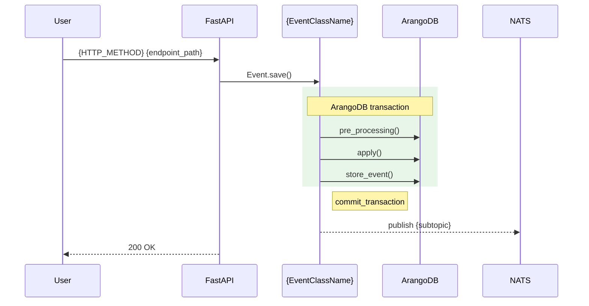

# {EventClassName}

**EventType:** `{ENUM_VALUE}`
**Domain:** {domain}
**NATS subject:** `progress.notification.{subtopic}` <!-- write "—" if _notification_subtopic is None -->

{1–2 prose sentences grounded in apply() source. Name specific preconditions
and state changes. NO filler phrases ("this event handles", "allows users to").}

<!-- Top-10 events only: insert ## Sequence Diagram block here.
     Remove this comment and the section below for non-top-10 events. -->

## Sequence Diagram

<!-- For diagrams with >20 nodes, prepend the diagram with:
     %%{init: {'layout': 'elk'}}%%
     and consider decomposing into multiple diagrams (EVT-05). -->

## Trigger

{Endpoint(s) that instantiate this event — fully-qualified path.}

## Preconditions

{Validation logic from apply() / pre_processing(). One bullet per check.}

## State Changes (Transaction)

**Collections:** {tx_collections list — explicit or inherited from Base{Domain}Event}

{What apply() mutates. One bullet per collection touched.}

## Side Effects (post_processing)

{Child events spawned via create_as_child(). NATS publish behavior. If inherited
from Base{Domain}Event, write: "Inherits post_processing() from Base{Domain}Event."}

## InfoModel Fields

| Field | Type | Description |
|-------|------|-------------|
| {field} | {type} | {description from source / inferred from name} |

## Related Events

{Cross-links to child event pages. Format:
- [`ChildEventName`](/events/{domain}/{event-slug}/) — {when spawned}}

## Source

[`{ClassName}` on GitHub](https://github.com/ProgressLabIT/progress-platform/blob/DEV/backend/api/events/{domain}/{filename}.py)
