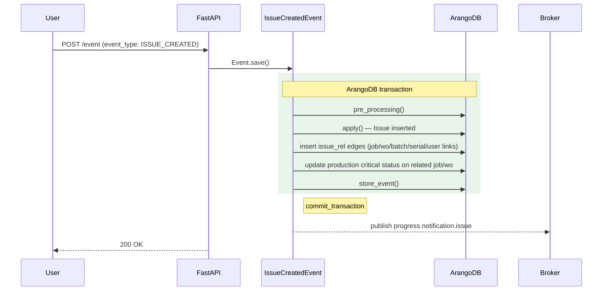

# IssueCreatedEvent

**EventType:** `ISSUE_CREATED`
**Domain:** collaboration
**Broker subject:** `progress.notification.issue`

Inserts a new `Issue` document and creates `issue_rel` edges to all linked
entities (work orders, jobs, products, serials, users, etc.). After writing
the issue, updates the `critical` flag on any linked work orders and jobs
based on the new issue's severity.

## Sequence Diagram

## Trigger

**Triggered by:** [POST /event](/api/traceability/post-event) (universal event dispatcher)

Dispatched via `POST /event` in `backend/api/endpoints/traceability.py`
with `event_type: ISSUE_CREATED`.

## Preconditions

- `info.issue_data` contains a valid `IssueWithLinks` payload
- All entities referenced in `linked_to` must exist

## State Changes (Transaction)

**Collections:** `Event`, `Issue`, `issue_rel`, `WorkOrder`, `Job`, `message`
(inherited from `BaseCollaboration.get_tx_collections()`)

- `Issue` document inserted
- `issue_rel` edges inserted for each entry in `linked_to`
- `WorkOrder` and `Job` `critical` flags updated via
  `_update_production_status()`

## Side Effects (post_processing)

Inherits `post_processing()` from `BaseCollaboration` (which extends `BaseEvent`).
`BaseCollaboration` does not override `_notification_subtopic`, but the
`Issue*` events resolve to `progress.notification.issue` via the domain
broker subject map.

## InfoModel Fields

| Field | Type | Description |
|-------|------|-------------|
| `issue_data` | `Any \| None` | Full `IssueWithLinks` payload including `linked_to` array |

## Related Events

_None._

## Source

[`IssueCreatedEvent` on GitHub](https://github.com/ProgressLabIT/progress-platform/blob/DEV/backend/api/events/collaboration/issue_created.py)
