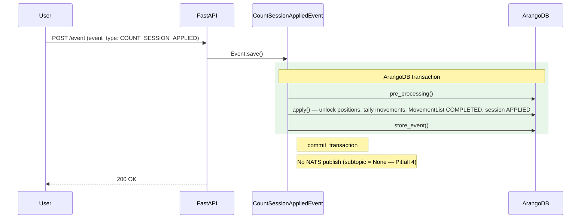

# CountSessionAppliedEvent

**EventType:** `COUNT_SESSION_APPLIED`
**Domain:** inventory
**Broker subject:** —

Finalises an inventory count session after its async processing completes.
Validates the session is in `PROCESSING` status, unlocks all positions
locked by the session, tallies movements created vs failed, marks the
adjustment `MovementList` as `COMPLETED`, and updates the session to
`APPLIED` with result statistics.

::: warning No NATS notification
`CountSessionAppliedEvent` extends `BaseEvent` directly — not
`BaseInventoryEvent`. Its `_notification_subtopic` is `null`, so no NATS
message is published after commit. Downstream consumers poll or re-read the
session state after async processing signals completion.
:::

## Sequence Diagram

## Trigger

**Triggered by:** [POST /event](/api/traceability/post-event) (universal event dispatcher)

Dispatched via `POST /event` in `backend/api/endpoints/traceability.py`
with `event_type: COUNT_SESSION_APPLIED`. Called by the async count-session
processing worker after all per-record movements have been applied.

## Preconditions

- `InventoryCountSession` exists with key `info.session_key`
- Session `status` is `PROCESSING` (raises `ValueError` otherwise)

## State Changes (Transaction)

**Collections:** `InventoryCountSession`, `inventory_count_record`,
`MovementList`, `movement`, `is_in_position`

- `is_in_position` records with `locked == true AND locked_by == session_key`
  updated: `locked → false`, `locked_by → null`
- `MovementList` (the session's `adjustment_list_key`) updated:
  `status → COMPLETED`, `end` timestamp set
- `InventoryCountSession` updated: `status → APPLIED`,
  `movements_created`, `movements_failed`, `processing_completed` timestamp

## Side Effects (post_processing)

Inherits `post_processing()` from `BaseEvent` — no NATS publish.

## InfoModel Fields

| Field | Type | Description |
|-------|------|-------------|
| `session_key` | `str` | ArangoDB key of the inventory count session to finalize |

## Related Events

_None._

## Source

[`CountSessionAppliedEvent` on GitHub](https://github.com/ProgressLabIT/progress-platform/blob/DEV/backend/api/events/inventory/count_session_applied.py)
