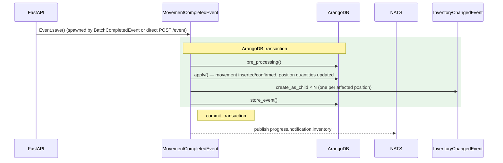

# MovementCompletedEvent

**EventType:** `MOVEMENT_COMPLETED`
**Domain:** inventory
**NATS subject:** `progress.notification.inventory`

Records a confirmed inventory movement of any type (RECEIPT, SHIPMENT,
ADJUSTMENT, TRANSFER, PRODUCTION, CONSUMPTION). Dispatches to a
type-specific handler that updates `is_in_position` quantities via child
`InventoryChangedEvent` records. Optionally creates a `SerialCreatedEvent`
child for receipts of traceable products without an existing serial.

## Sequence Diagram

## Trigger

**Triggered by:** [POST /event](/api/traceability/post-event) (universal event dispatcher)

Dispatched via `POST /event` in `backend/api/endpoints/traceability.py`
with `event_type: MOVEMENT_COMPLETED`. Also spawned as a child event by
`BatchCompletedEvent` for PRODUCTION and CONSUMPTION movements.

## Preconditions

- `movement_type` must not be `REVERSAL` (use `MovementReversedEvent` instead)
- `position_from` and `position_to` (if provided and not `NULL`/`OUT`) must exist and not be deleted
- `product_key` is required unless it is a container TRANSFER with explicit positions

## State Changes (Transaction)

**Collections:** Inherited from `BaseInventoryEvent.get_tx_collections()`

- `movement` document inserted (new movement) or updated (planned movement confirmed)
- `is_in_position` updated via `InventoryChangedEvent` child events for each position affected
- `Serial` potentially created via `SerialCreatedEvent` for traced receipt

## Side Effects (post_processing)

Inherits `post_processing()` from `BaseInventoryEvent`:
- Publishes to `progress.notification.inventory`

## InfoModel Fields

| Field | Type | Description |
|-------|------|-------------|
| `movement_key` | `str \| None` | Key of an existing planned movement to confirm (null for new movements) |
| `movement_type` | `InventoryMovementType` | Movement type: RECEIPT, SHIPMENT, ADJUSTMENT, TRANSFER, PRODUCTION, CONSUMPTION |
| `product_key` | `str \| None` | ArangoDB key of the product (not required for container TRANSFER) |
| `qt_planned` | `float` | Planned quantity |
| `qt_confirmed` | `float` | Confirmed quantity |
| `serial_key` | `str \| None` | Serial key (required for traceable SHIPMENT) |
| `serial_code` | `str \| None` | Serial code for receipt auto-creation (excluded from event payload) |
| `position_from` | `str \| None` | Source position key (`NULL` for PRODUCTION, `OUT` for RECEIPT) |
| `position_to` | `str \| None` | Destination position key (`NULL` for CONSUMPTION, `OUT` for SHIPMENT) |
| `movement_list_key` | `str \| None` | Key of the movement list this movement belongs to |
| `movement_list_item` | `float \| None` | Item index within the movement list |
| `references` | `InventoryMovementReferences \| None` | Contextual references (job, batch, work order) |
| `reason` | `str \| None` | Reason for the movement |
| `extra` | `Any` | Additional arbitrary data |

## Related Events

- [`InventoryChangedEvent`](/events/inventory/inventory-changed) — spawned for each position quantity update
- [`SerialCreatedEvent`](/events/serial/serial-created) — spawned for receipt of a traceable product without an existing serial

## Source

[`MovementCompletedEvent` on GitHub](https://github.com/ProgressLabIT/progress-platform/blob/DEV/backend/api/events/inventory/movement_completed.py)
