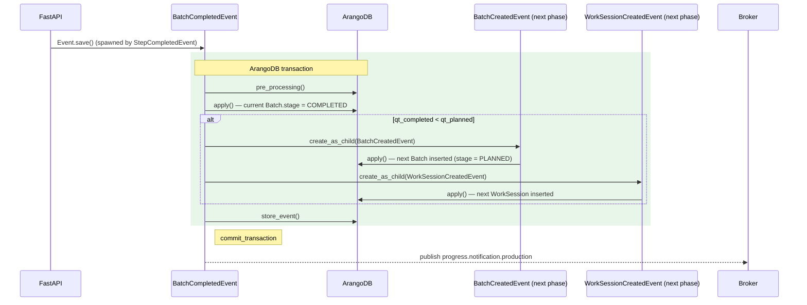

# BatchCompleted -> next-phase batch spawn

This page illustrates the **fan-out pattern** of `BatchCompletedEvent`
specifically for the case where the work order has more remaining
production quantity to make. Per EVT-05, fan-out events are decomposed
into multiple diagrams — the [BatchCompletedEvent main page](/events/production/batch-completed)
covers the primary commit path; this page focuses on the next-phase
spawn lifecycle in isolation, so the parent->child relationship is
visible without the noise of the other 7+ siblings.

## Pattern Summary

When `BatchCompletedEvent` runs and the work order's `qt_completed` is
**still less than** `qt_planned`, the event spawns:

1. A new `BatchCreatedEvent` for the next batch in the sequence
2. A new `WorkSessionCreatedEvent` to wrap the new batch's execution

This produces the **production loop**: `JobStartedEvent` ->
`StepCompletedEvent` × N -> `BatchCompletedEvent` -> next
`BatchCreatedEvent` -> next `WorkSessionCreatedEvent` -> ... -> last
`BatchCompletedEvent` -> `JobClosedEvent`.

## Sequence Diagram

## Why this is decomposed (EVT-05)

The full `BatchCompletedEvent` lifecycle spawns up to 12 distinct child
events (WIP movements, serial updates, work-session close, batch
release, optional job close, plus the next-phase spawn shown here).
Rendering all of those in one diagram exceeds 30 nodes and obscures the
specific decision the reader cares about: _"when does the next batch
start?"_. EVT-05 directs that fan-out events be broken into focused
diagrams; this page is the focused view of the next-phase spawn.

For the full primary path see the [BatchCompletedEvent main page](/events/production/batch-completed).

## Related

- [`BatchCompletedEvent`](/events/production/batch-completed) — the parent event (full diagram)
- [`BatchCreatedEvent`](/events/production/batch-created) — the spawned next-phase batch
- [`WorkSessionCreatedEvent`](/events/work_session/work-session-created) — the spawned next-phase session
- [`JobClosedEvent`](/events/production/job-closed) — the alternative branch when qt_completed >= qt_planned

## Source

[`BatchCompletedEvent.apply()` on GitHub](https://github.com/ProgressLabIT/progress-platform/blob/DEV/backend/api/events/production/batch_completed.py)
