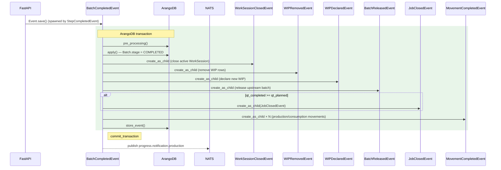

# BatchCompletedEvent

**EventType:** `BATCH_COMPLETED`
**Domain:** production
**Broker subject:** `progress.notification.production`

Records completion of an active batch against a job: validates that the
declared quantity matches the batch total, stores step execution data,
handles serial linking/releasing, triggers inventory movements for consumed
and produced materials, and either closes the job (last batch) or creates a
new batch (continuation).

## Sequence Diagram

> **See also:** the [BatchCompleted -> child-batch-spawn fan-out](/events/production/batch-completed-fanout)
> diagram illustrates how this event spawns the next-phase batch when remaining
> production quantity is non-zero (per EVT-05 decomposition rule).

## Trigger

**Triggered by:** [POST /event](/api/traceability/post-event) (universal event dispatcher)

Dispatched via `POST /event` in `backend/api/endpoints/traceability.py`
with `event_type: BATCH_COMPLETED`. Also spawned as a child event by
`StepCompletedEvent` when all steps in the batch are marked done.

## Preconditions

- Batch exists with key `info.active_batch_key`
- `info.completed_batch_qt` must equal `batch.qt_total` (raise `ValueError` otherwise)
- Job `stage` is not `closed`

## State Changes (Transaction)

**Collections:** Inherited from `BaseProductionEvent.get_tx_collections()`

- `Batch` updated: marked completed, `qt_total` confirmed
- `Job` updated: `qt_completed` incremented
- `StepExecutionData` written if `info.step_data` provided and step-check is inactive
- Serial records linked/released via `SerialLinkedEvent` / `SerialReleasedEvent` child events
- Inventory movements triggered via `MovementCompletedEvent` child events for consumption/production
- WIP records removed via `WIPRemovedEvent` / `WIPDeclaredEvent` child events
- Work session closed via `WorkSessionClosedEvent` child event
- If last batch: `JobClosedEvent` spawned as child
- If continuation: `BatchCreatedEvent` + `WorkSessionCreatedEvent` spawned as children

## Side Effects (post_processing)

Inherits `post_processing()` from `BaseProductionEvent`:
- Updates `job.last_online`
- Recalculates work order status; spawns `WorkOrderClosedEvent` if WO transitions to closed
- Publishes to `progress.notification.production`

## InfoModel Fields

| Field | Type | Description |
|-------|------|-------------|
| `active_batch_key` | `str` | Key of the active batch to complete |
| `completed_batch_qt` | `float` | Quantity declared as completed (must match batch total) |
| `step_data` | `list[ExecutionDataUpdate] \| None` | Step execution data to store if step-check is inactive |
| `batch_serial_keys` | `list[str] \| None` | Serial keys associated with this batch |
| `job_key` | `str \| None` | Job key (resolved from batch if not provided) |
| `work_order_key` | `str \| None` | Work order key (resolved from batch if not provided) |

## Related Events

- [`JobClosedEvent`](/events/production/job-closed) — spawned when batch completes the last required quantity
- [`BatchCreatedEvent`](/events/production/batch-created) — spawned when job continues with a new batch
- [`WorkSessionClosedEvent`](/events/work_session/work-session-closed) — spawned to close the current work session
- [`WorkSessionCreatedEvent`](/events/work_session/work-session-created) — spawned if a new batch is created
- [`SerialLinkedEvent`](/events/serial/serial-linked) — spawned to link serials to parent/batch
- [`SerialReleasedEvent`](/events/serial/serial-released) — spawned to release serials on completion
- [`MovementCompletedEvent`](/events/inventory/movement-completed) — spawned for PRODUCTION and CONSUMPTION movements
- [`WIPDeclaredEvent`](/events/wip/wip-declared) — spawned to declare WIP at phase boundary
- [`WIPRemovedEvent`](/events/wip/wip-removed) — spawned to remove WIP consumed by this batch

## Source

[`BatchCompletedEvent` on GitHub](https://github.com/ProgressLabIT/progress-platform/blob/DEV/backend/api/events/production/batch_completed.py)
