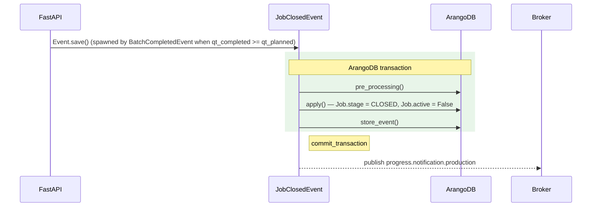

# JobClosedEvent

**EventType:** `JOB_CLOSED`
**Domain:** production
**Broker subject:** `progress.notification.production`

Closes a job by running the `COMPLETE_JOB` AQL macro, which sets
`stage → CLOSED`, records `qt_completed`, and writes `notes` and `end`
timestamp. Removes the job from the assigned operator's queue. Spawned as
a child of `BatchCompletedEvent` when the final batch is confirmed.

## Sequence Diagram

## Trigger

**Triggered by:** [POST /event](/api/traceability/post-event) (universal event dispatcher)

Spawned as a child event by `BatchCompletedEvent` in
`backend/api/events/production/batch_completed.py` when the completed
quantity meets the work order requirement. Also dispatched directly via
`POST /event` with `event_type: JOB_CLOSED` for manual force-close flows.

## Preconditions

- Job exists with key `info.job_key`
- Job has an `assigned_to` value (queue removal depends on this)

## State Changes (Transaction)

**Collections:** `Job`, `Queue`, `WorkOrder`, `Task`

- `Job` updated via `COMPLETE_JOB` AQL: `stage → CLOSED`, `qt_completed`,
  `notes`, `end`
- `Queue` entry removed for `completed_job.assigned_to`

## Side Effects (post_processing)

`JobClosedEvent` extends `BaseEvent` directly (not `BaseProductionEvent`),
with `_notification_subtopic = "production"` set explicitly.
Publishes to `progress.notification.production` after commit.

## InfoModel Fields

| Field | Type | Description |
|-------|------|-------------|
| `job_key` | `str` | ArangoDB key of the job to close |
| `completed_qt` | `float` | Final quantity declared as completed |
| `update_planned_qt` | `bool` | Whether to update the planned quantity to match completed |
| `phase_key` | `str \| None` | Phase key (resolved from job) |
| `work_order_key` | `str \| None` | Work order key (resolved from job) |
| `notes` | `str \| None` | Closing notes (defaults to "Job closed") |

## Related Events

_None._

## Source

[`JobClosedEvent` on GitHub](https://github.com/ProgressLabIT/progress-platform/blob/DEV/backend/api/events/production/job_closed.py)
