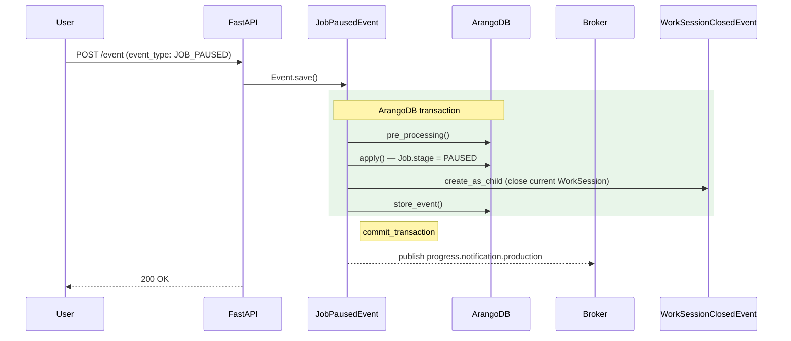

# JobPausedEvent

**EventType:** `JOB_PAUSED`
**Domain:** production
**Broker subject:** `progress.notification.production`

Pauses an active job, setting its stage to `PAUSED` and closing the
current work session. The job remains assigned and the active batch is
preserved. Used for voluntary operator pauses during normal operation.

## Sequence Diagram

## Trigger

**Triggered by:** [POST /event](/api/traceability/post-event) (universal event dispatcher)

Dispatched via `POST /event` in `backend/api/endpoints/traceability.py`
with `event_type: JOB_PAUSED`.

## Preconditions

- Job exists with key `info.job_key`
- Job `stage` is `STARTED`

## State Changes (Transaction)

**Collections:** Inherited from `BaseProductionEvent.get_tx_collections()`

- `Job` updated: `stage → PAUSED`
- `WorkSession` closed via `WorkSessionClosedEvent` child event

## Side Effects (post_processing)

Inherits `post_processing()` from `BaseProductionEvent`:
- Updates `job.last_online`
- Recalculates work order status
- Publishes to `progress.notification.production`

## InfoModel Fields

| Field | Type | Description |
|-------|------|-------------|
| `job_key` | `str` | ArangoDB key of the job to pause |
| `work_order_key` | `str \| None` | Work order key |
| `phase_key` | `str \| None` | Phase key |

## Related Events

- [`WorkSessionClosedEvent`](/events/work_session/work-session-closed) — spawned to close the current work session

## Source

[`JobPausedEvent` on GitHub](https://github.com/ProgressLabIT/progress-platform/blob/DEV/backend/api/events/production/job_paused.py)
