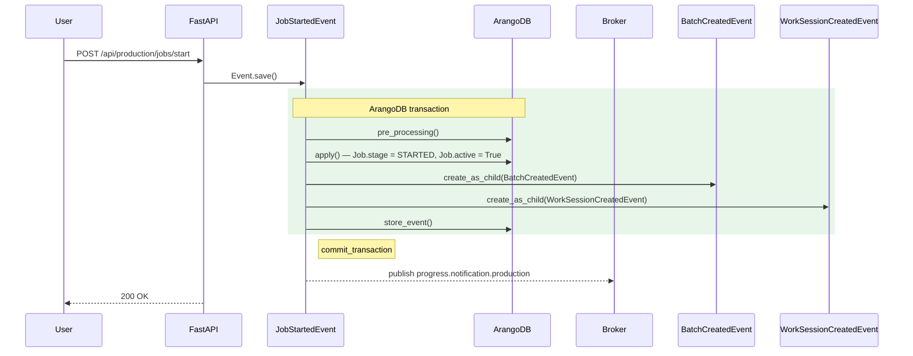

# JobStartedEvent

**EventType:** `JOB_STARTED`
**Domain:** production
**Broker subject:** `progress.notification.production`

Transitions a job from `CREATED` to `STARTED` state, creates the first
`Batch` and a `WorkSession` record as child events, assigns the operator
to the job, and optionally adds the job to the operator's queue when the
job was previously unassigned.

## Sequence Diagram

## Trigger

**Triggered by:** [POST /event](/api/traceability/post-event) (universal event dispatcher)

Dispatched via `POST /event` in `backend/api/endpoints/traceability.py`
with `event_type: JOB_STARTED`. The production webapp sends this when the
operator presses **Start Job** on the job assignment list.

## Preconditions

- Job exists with key `info.job_key`
- Job `stage` is `CREATED` (raises `JobIsStartedError` otherwise)
- If `config.show_unassigned_jobs_to_operators` is `false`, job must have
  an `assigned_to` value (raises `JobHasNoAssigneeError` otherwise)

## State Changes (Transaction)

**Collections:** Inherited from `BaseProductionEvent.get_tx_collections()` —
`Batch`, `batch_serial`, `Event`, `Job`, `Queue`, `Serial`, `StepExecutionData`,
`wip`, `WorkOrder`, `WorkSession`, `contains`, `Config`, `Counter`,
`is_in_position`, `Position`, `movement`, `Issue`, `issue_rel`

- `Job` updated: `stage → STARTED`, `start`, `active → true`,
  `assigned_to`, `active_batch_key`, `active_batch_qt`, `last_online`,
  `last_work_session_started`
- `Batch` inserted via `BatchCreatedEvent.create_as_child()`
- `WorkSession` inserted via `WorkSessionCreatedEvent.create_as_child()`
- `Queue` updated if job was unassigned and `can_self_assign` is true

## Side Effects (post_processing)

Inherits `post_processing()` from `BaseProductionEvent`:
- Updates `job.last_online` timestamp
- Recalculates work order status via `update_work_order()`; spawns
  `WorkOrderStartedEvent` as child if work order transitions to `STARTED`
- Publishes to `progress.notification.production`

## InfoModel Fields

| Field | Type | Description |
|-------|------|-------------|
| `job_key` | `str` | ArangoDB key of the job to start |
| `batch_serials` | `list[str] \| None` | Serial keys to associate with the first batch |
| `work_order_key` | `str \| None` | Work order key (carried through to child events) |
| `phase_key` | `str \| None` | Phase key for the job's current phase |

## Related Events

- [`BatchCreatedEvent`](/events/production/batch-created) — spawned as child to create the first active batch
- [`WorkSessionCreatedEvent`](/events/work_session/work-session-created) — spawned as child to open the operator's session

## Source

[`JobStartedEvent` on GitHub](https://github.com/ProgressLabIT/progress-platform/blob/DEV/backend/api/events/production/job_started.py)
