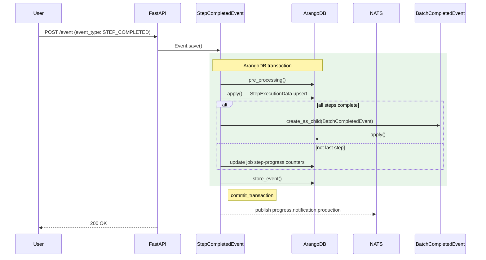

# StepCompletedEvent

**EventType:** `STEP_COMPLETED`
**Domain:** production
**NATS subject:** `progress.notification.production`

Marks a single step within an active batch as done by writing a
`StepExecutionData` record. If this was the last pending step in the batch,
triggers `BatchCompletedEvent` as a child. Otherwise updates job step-progress
counters in place.

## Sequence Diagram

## Trigger

**Triggered by:** [POST /event](/api/traceability/post-event) (universal event dispatcher)

Dispatched via `POST /event` in `backend/api/endpoints/traceability.py`
with `event_type: STEP_COMPLETED`. The production webapp sends this when the
operator completes a step in the step-check flow.

## Preconditions

- Batch exists with key `info.batch_key`
- Job is retrievable from `batch.job_key`
- An active `WorkSession` exists for the job

## State Changes (Transaction)

**Collections:** Inherited from `BaseProductionEvent.get_tx_collections()`

- `StepExecutionData` upserted: records step completion with `user_key`,
  `work_session_key`, `batch_key`, `step_key`, `completed` timestamp,
  `status: DONE`, and optional `form_data`
- If all steps done: `BatchCompletedEvent` spawned as child (see that page for
  further mutations)
- If steps remain: job step-progress counters updated

## Side Effects (post_processing)

Inherits `post_processing()` from `BaseProductionEvent`:
- Updates `job.last_online`
- Recalculates work order status
- Publishes to `progress.notification.production`

## InfoModel Fields

| Field | Type | Description |
|-------|------|-------------|
| `batch_key` | `str` | ArangoDB key of the active batch |
| `step_key` | `str` | ArangoDB key of the step being completed |
| `job_key` | `str \| None` | Job key (resolved from batch) |
| `work_order_key` | `str \| None` | Work order key (resolved from batch) |
| `form_data` | `list[FormFieldValue] \| None` | Form field values captured at step completion |
| `batch_serials` | `list[str] \| None` | Serial keys for the batch (forwarded to BatchCompletedEvent) |

## Related Events

- [`BatchCompletedEvent`](/events/production/batch-completed/) — spawned as child when the last step in the batch is marked done

## Source

[`StepCompletedEvent` on GitHub](https://github.com/ProgressLabIT/progress-platform/blob/DEV/backend/api/events/production/step_completed.py)
