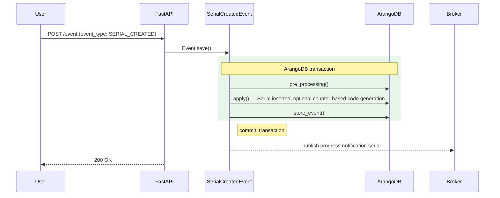

# SerialCreatedEvent

**EventType:** `SERIAL_CREATED`
**Domain:** serial
**Broker subject:** `progress.notification.serial`

Creates a new `Serial` document for a product that has traceability enabled.
If the product requires a code at creation (or the serial is being released
immediately), generates one via the product's linked counter. Raises
`SerialCodeAlreadyPresent` if the code is already in use for the product.

## Sequence Diagram

## Trigger

**Triggered by:** [POST /event](/api/traceability/post-event) (universal event dispatcher)

Dispatched via `POST /event` in `backend/api/endpoints/traceability.py`
with `event_type: SERIAL_CREATED`. Also spawned as a child event by
`MovementCompletedEvent` for receipts of traceable products without an
existing serial.

## Preconditions

- Product exists with key `info.product_key`
- Product has `traceability_level` enabled
- If `info.code` provided: code is not already in use for the product
- If serial needs a code and none provided: product has a `counter_key`

## State Changes (Transaction)

**Collections:** Inherited from `BaseSerialEvent.get_tx_collections()`

- `Serial` inserted with product key, optional code, form data, and
  `released` timestamp
- `Counter` incremented if code was auto-generated

## Side Effects (post_processing)

Inherits `post_processing()` from `BaseSerialEvent`:
- Publishes to `progress.notification.serial`

## InfoModel Fields

| Field | Type | Description |
|-------|------|-------------|
| `data` | `list[SerialFormFieldValue] \| None` | Initial form field data for the serial |
| `code` | `ProcessedSerialCode \| None` | Pre-assigned serial code object |
| `wo_key` | `str \| None` | Work order key to associate with the serial |
| `product_key` | `str \| None` | ArangoDB key of the product |
| `counter_key` | `str \| None` | Counter key for auto-code generation (resolved from product) |
| `released` | `datetime \| None` | Release timestamp (defaults to now if provided) |

## Related Events

_None._

## Source

[`SerialCreatedEvent` on GitHub](https://github.com/ProgressLabIT/progress-platform/blob/DEV/backend/api/events/serial/serial_created.py)
