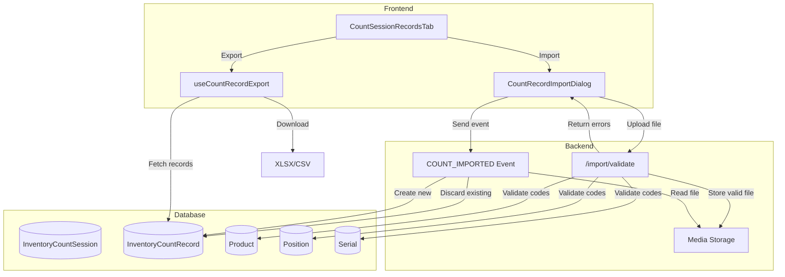
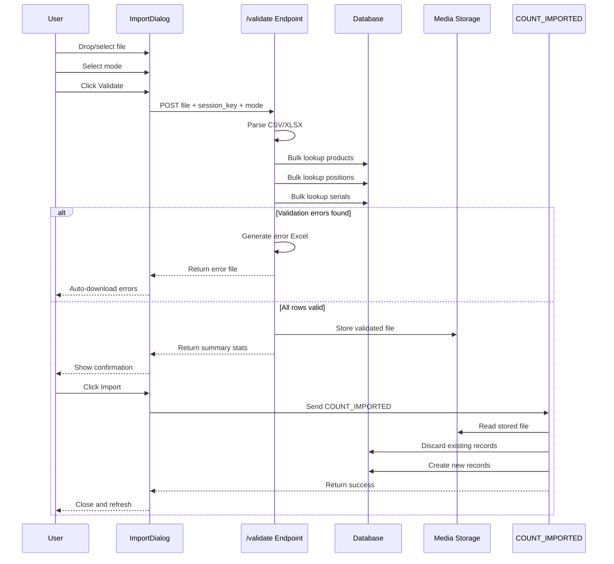

# Count Record Import/Export Functionality

This document describes the import and export functionality for inventory count records, enabling bulk data operations for count sessions.

---

## Overview

The count record import/export feature allows users to:
- **Export** all count records from a session to CSV or XLSX format
- **Import** count records from CSV/XLSX files back into a session

This enables offline counting workflows, data correction, and integration with external systems.

---

## Architecture



---

## Export

### Supported Formats
- **XLSX** (Excel) - with translated column headers
- **CSV** - with standardized column names

### Export Columns

| Column | Description |
|--------|-------------|
| `position_code` | Warehouse position code |
| `product_code` | Product code |
| `serial_code` | Serial code (empty for non-serialized products) |
| `system_qt` | System quantity at count time |
| `counted_qt` | Quantity counted by user |
| `delta` | Difference (counted_qt - system_qt) |
| `user` | Username who performed the count |
| `counted_at` | Timestamp of the count |

### Serial Explosion

Export always **explodes serialized records to individual rows**:
- Each counted serial becomes a separate row with `counted_qt = 1`
- Removed serials (in system but not counted) appear with `counted_qt = 0`
- Non-serialized records export as single rows with aggregate quantities

### Example Export (Serialized Product)

| position_code | product_code | serial_code | system_qt | counted_qt | delta |
|--------------|--------------|-------------|-----------|------------|-------|
| A1 | PROD001 | SN-001 | 1 | 1 | 0 |
| A1 | PROD001 | SN-002 | 1 | 1 | 0 |
| A1 | PROD001 | SN-003 | 1 | 0 | -1 |
| A2 | PROD002 | | 10 | 8 | -2 |

### Export Flow

```
User clicks Export → Select format (CSV/XLSX)
       │
       ▼
Fetch all session records (no UI filters applied)
       │
       ▼
Explode serialized records to individual rows
       │
       ▼
Generate file → Download
```

---

## Import

### Supported Formats
- **CSV** - UTF-8 encoded (BOM supported)
- **XLSX** - Excel 2007+ format

### Required Columns

| Column | Required | Description |
|--------|----------|-------------|
| `position_code` | ✅ | Warehouse position code |
| `product_code` | ✅ | Product code |
| `counted_qt` | ✅ | Quantity counted |
| `serial_code` | ❌ | Serial code (required for serialized products) |

### Ignored Columns

The following columns from exports are **ignored during import** (system quantities are always fetched fresh from the database):
- `system_qt`
- `delta`
- `user`
- `counted_at`

A warning is displayed if these columns are present in the import file.

---

## Import Modes

### Update Mode (Default)
- **Behavior**: Only affects records matching imported product/position pairs
- **Existing records** for the same product/position are discarded
- **Other records** in the session remain unchanged
- **Use case**: Correct specific counts without affecting others

### Replace Mode
- **Behavior**: Replaces ALL session records
- **All existing records** are discarded before import
- **Use case**: Full re-import from external system
- **Requires confirmation**: User must check a confirmation box

---

## Import Validation

### Two-Phase Process

1. **Validation Phase** - File is parsed and validated
   - On success: File stored in media, summary returned
   - On error: Annotated Excel file downloaded automatically

2. **Import Phase** - Validated file is processed
   - Records are created via `COUNT_IMPORTED` event
   - Existing records are discarded based on import mode

### Import Flow Sequence



### Validation Rules

#### Product Validation
| Check | Error Message |
|-------|--------------|
| Product code missing | "Missing product_code" |
| Product not found | "Product 'XXX' not found" |

#### Position Validation
| Check | Error Message |
|-------|--------------|
| Position code missing | "Missing position_code" |
| Position not found | "Position 'XXX' not found" |

#### Serial Validation
| Check | Error Message |
|-------|--------------|
| Serial not found | "Serial 'XXX' not found for product 'YYY'" |
| Serial belongs to different product | "Serial 'XXX' belongs to different product" |
| Deleted serial | "Serial 'XXX' not found" |

#### Traceability Validation
| Product Type | Serial Provided | Result |
|--------------|-----------------|--------|
| Serialized | Yes | ✅ Valid |
| Serialized | No | ❌ "Product 'XXX' requires a serial number" |
| Non-serialized | No | ✅ Valid |
| Non-serialized | Yes | ❌ "Product 'XXX' does not support serial numbers" |

#### Quantity Validation
| Check | Error Message |
|-------|--------------|
| Quantity missing | "Missing counted_qt" |
| Non-numeric value | "Invalid counted_qt value: 'abc'" |
| Serial with invalid qty | "Invalid counted_qt for serial: must be 0 or 1, got '5'" |

---

## Error File

When validation fails, an annotated Excel file is automatically downloaded:

### Error File Format
- Original data preserved in first columns
- `status` column: "OK" or "ERROR"
- `errors` column: Detailed error messages (semicolon-separated if multiple)
- Error rows highlighted in red

### Example Error File

| position_code | product_code | serial_code | counted_qt | status | errors |
|--------------|--------------|-------------|------------|--------|--------|
| A1 | PROD001 | | 10 | OK | |
| INVALID | PROD002 | | 5 | ERROR | Position 'INVALID' not found |
| A2 | INVALID | | 5 | ERROR | Product 'INVALID' not found |
| A1 | SERIAL_PROD | | 5 | ERROR | Product 'SERIAL_PROD' requires a serial number |

---

## Serial Aggregation on Import

Multiple import rows for the same product/position are **aggregated**:

### Serialized Products
- Each row with `counted_qt > 0` adds the serial to counted serials
- Rows with `counted_qt = 0` are treated as "not found" (serial excluded)
- Final `counted_qt` = number of counted serials

### Non-Serialized Products
- Quantities are summed across all rows for the same product/position

### Example Aggregation

**Import Data:**
```csv
position_code,product_code,serial_code,counted_qt
A1,PROD001,SN-001,1
A1,PROD001,SN-002,1
A1,PROD001,SN-003,0
```

**Result:**
- 1 count record created
- `counted_serial_keys` = [SN-001, SN-002]
- `counted_qt` = 2

---

## System Quantities

System quantities are **always fetched from the database** at import time:
- `system_qt` reflects current inventory at the position
- `system_serial_keys` lists all serials currently in the position
- Imported `system_qt` or `delta` columns are ignored

---

## API Endpoints

### Validation Endpoint
```
POST /inventory/count-record/import/validate
Content-Type: multipart/form-data

Parameters:
- file: Upload file (CSV/XLSX)
- count_session_key: Session key
- import_mode: "update" or "replace"

Response (Success):
{
  "status": "valid",
  "file_key": "uuid",
  "filename": "original.csv",
  "rows_total": 100,
  "rows_valid": 100,
  "records_to_add": 50,
  "records_to_discard": 10,
  "import_mode": "update",
  "ignored_columns": ["system_qt", "delta"]
}

Response (Errors):
Content-Type: application/vnd.openxmlformats-officedocument.spreadsheetml.sheet
Headers:
  X-Import-Status: error
  X-Error-Count: 5
  X-Valid-Count: 95
Body: Excel file with error annotations
```

### Import Event
```json
{
  "event_type": "COUNT_IMPORTED",
  "event_data": {
    "count_session_key": "session_key",
    "import_mode": "update",
    "import_file_key": "uuid_from_validation",
    "import_filename": "original.csv"
  }
}
```

---

## UI Flow

### Import Dialog

```
┌──────────────────────────────────────────────┐
│  Import Count Records                        │
├──────────────────────────────────────────────┤
│                                              │
│  ┌────────────────────────────────────────┐  │
│  │         📄 Drop file here              │  │
│  │         or click to browse             │  │
│  │            .csv, .xlsx                 │  │
│  └────────────────────────────────────────┘  │
│                                              │
│  Import Mode:                                │
│  ┌──────────────┬──────────────┐            │
│  │   Update     │   Replace    │            │
│  └──────────────┴──────────────┘            │
│                                              │
│  ⚠️ Warning: Replace will discard ALL       │
│     existing records in this session         │
│                                              │
│  [Cancel]                    [Validate]      │
└──────────────────────────────────────────────┘
```

### State Transitions

```
File Selected → [Validate] → Validation Success
                    │              │
                    ▼              ▼
              Error File      [Import] → Success → Dialog closes
              Downloaded           │
                    │              ▼ (Replace mode)
                    ▼         ☑ Confirm checkbox required
              [Try Again]
```

---

## Round-Trip Integrity

Export and re-import should preserve count data:

1. **Export session records**
2. **Modify file** (optional)
3. **Import with Update mode**
4. **Result**: Modified records replaced, others unchanged

### Handling Removed Serials

- Exports show removed serials with `counted_qt = 0`
- Importing with `counted_qt = 0` excludes the serial from counted serials
- This correctly handles "serial was in system but not found during count"

---

## File Examples

### Simple CSV (Non-Serialized)
```csv
position_code,product_code,counted_qt
A1,PROD001,10
A2,PROD002,5
A3,PROD003,0
```

### CSV with Serials
```csv
position_code,product_code,serial_code,counted_qt
A1,PROD001,SN-001,1
A1,PROD001,SN-002,1
A1,PROD001,SN-003,0
A2,PROD002,,5
```

### Invalid CSV (for Error Testing)
```csv
position_code,product_code,serial_code,counted_qt
INVALID_POS,PROD001,,10
A1,INVALID_PROD,,5
A1,PROD001,INVALID_SERIAL,1
A1,PROD001,,abc
```

---

## Edge Cases

| Scenario | Behavior |
|----------|----------|
| Empty file | Error: "No data rows found" |
| File with only headers | Error: "No data rows found" |
| Large file (1000+ rows) | Processed in chunks, all errors reported |
| Duplicate serial rows | Last row's quantity used |
| All serials qty=0 | Record created with empty counted_serials, counted_qt=0 |
| Mixed serial/quantity rows | Serial logic takes precedence |
| UTF-8 BOM in CSV | Handled correctly |

---

## Permissions & Prerequisites

- User must have access to the count session
- Session must be in "started" status
- Products, positions, and serials must exist in the database
- For serialized products, valid serial codes are required

---

## Design Rationale

### Why Event-Based Import?

- **Audit trail**: The `COUNT_IMPORTED` event captures who imported what and when
- **Consistency**: Uses the same event system as manual counts (`COUNT_STARTED`, `COUNT_COMPLETED`)
- **Atomicity**: All records are created in a single transaction
- **File reference**: Original file stored in media for future reference

### Why Strict Validation (All-or-Nothing)?

- **Data integrity**: Partial imports could leave session in inconsistent state
- **User clarity**: Clear feedback via annotated error file
- **Simpler recovery**: User fixes file and re-uploads, no orphaned records

### Why Two-Phase (Validate then Import)?

- **User confirmation**: Especially important for Replace mode
- **Preview stats**: User sees impact before committing
- **File storage**: Validated file stored once, reused by event

### Why Fetch System Quantities from Database?

- **Accuracy**: System quantities may have changed since export
- **Simplicity**: Single source of truth for inventory state
- **Safety**: Prevents stale data from corrupting delta calculations

---

## Related Components

- `CountRecordImportDialog.vue` - UI dialog for import
- `useCountRecordExport.js` - Composable for export functionality
- `count_imported.py` - Backend event handler
- `counting.py` - API endpoints
- [Test Cases](count-import-test-cases.md) - Comprehensive test scenarios

